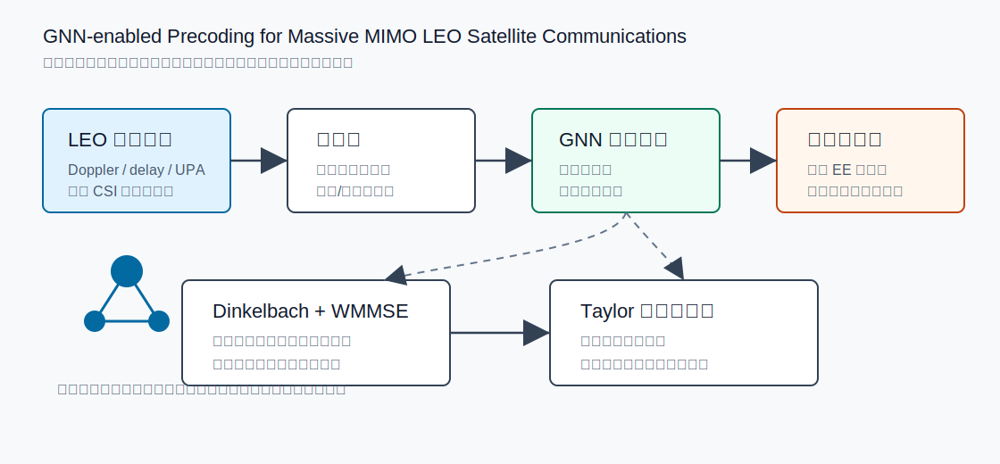
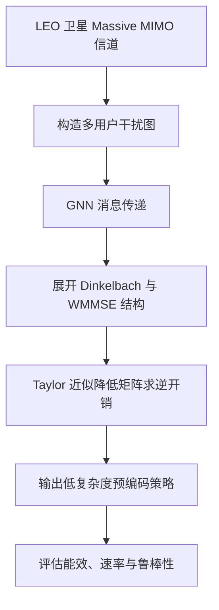

# 从 GNN 预编码看 LEO Massive MIMO 的低复杂度推理

## 1. 论文基本信息

* 英文标题：GNN-enabled Precoding for Massive MIMO LEO Satellite Communications
* 中文理解标题：面向 LEO 卫星 Massive MIMO 通信的 GNN 辅助预编码方法
* 作者：Huibin Zhou, Xinrui Gong, Christos G. Tsinos, Li You, Xiqi Gao, Bjorn Ottersten
* 期刊/会议：IEEE Transactions on Communications
* 年份：2025
* DOI：10.1109/TCOMM.2025.3568216
* IEEE Xplore 链接：https://doi.org/10.1109/TCOMM.2025.3568216
* 阅读日期：2026-06-13
* 关键词：LEO satellite, massive MIMO, GNN, precoding, energy efficiency, channel aging

## 2. 为什么选择这篇论文

这篇论文值得读，是因为它把三个很关键的方向放在同一个问题里：LEO satellite communications、massive MIMO precoding、graph neural network。当前研究工作关心的是 LEO satellite cell-free massive MIMO 下的 millisecond-level downlink SINR prediction，核心难点不是单纯“能不能预测”，而是能不能在高速运动、强干扰耦合、CSI 过时和低时延约束下做出可用的推理。

这篇论文虽然不是 cell-free massive MIMO 论文，但它处理的是 LEO massive MIMO 下的低复杂度预编码。预编码、SINR prediction 和 interference-aware message passing 的共同点在于：它们都要把多用户之间的干扰关系压缩成可计算、可泛化、可快速推理的表示。论文使用 GNN 学习预编码结构，对我理解“为什么图结构适合 LEO 卫星网络中的干扰建模”很有帮助。

另一个选择理由是它不是泛泛讨论 AI for wireless，而是把 GNN 放进 Dinkelbach transform、WMMSE 和 Taylor 近似这类通信优化工具链中。这样的写法比单纯堆神经网络更适合 IEEE 通信期刊的叙事：先有明确物理层目标，再用学习方法降低求解复杂度。

## 3. 论文要解决的问题

LEO 卫星通信的一个典型矛盾是：卫星运动快、信道变化快、波束覆盖和用户几何关系变化明显，但 massive MIMO 预编码又通常需要较重的矩阵运算和较新的 CSI。如果每个调度周期都依赖传统迭代优化，计算开销和时延会成为系统瓶颈；如果只用简单线性预编码，又可能损失能效和抗干扰能力。

论文关注的是 Massive MIMO LEO satellite communications 中的预编码设计，目标是提高系统能效。这里的能效不是只看频谱效率，也不是只看发射功率，而是要在吞吐收益和功率消耗之间取得平衡。对 LEO 卫星来说，这个目标很自然：星上算力、电源、散热和载荷资源都有限，不能把地面基站里的重计算方案原样搬上去。

传统方法的不足主要体现在两个方面。第一，Dinkelbach transform 和 WMMSE 这类优化方法有清晰的数学结构，但迭代计算复杂度高，尤其涉及矩阵求逆时更明显。第二，直接使用深度神经网络虽然推理快，但容易被质疑缺少通信结构先验，难以解释为什么它能在不同信道条件下稳定工作。论文的核心动机就是在这两者之间找折中：用优化理论提供结构，用 GNN 提供快速映射能力。

## 4. 系统模型和关键假设

论文考虑的是 LEO satellite massive MIMO 下行通信场景。卫星侧配置大规模天线阵列，为多个地面用户提供服务。由于 LEO 卫星高速运动，信道不仅受路径损耗和阵列响应影响，也会受到时延、Doppler 和 CSI aging 的影响。论文在建模中强调了 LEO 场景的信道动态性，而不是把它简化成普通地面蜂窝 massive MIMO。

从通信任务看，系统需要根据可用 CSI 设计预编码矩阵。预编码会影响每个用户接收信号的有用项和干扰项，进而影响速率和能效。多用户之间天然构成一个图：节点可以理解为用户或链路状态表示，边可以表达干扰、相关性或消息传递关系。GNN 在这里的作用，就是把这种多用户耦合关系编码进模型，而不是把所有用户当作互不相关的样本。

论文还引入了优化目标和算法展开的视角。能效最大化通常是分式优化问题，直接求解不方便。作者用 Dinkelbach transform 处理分式结构，用 WMMSE 处理速率与均方误差之间的等价关系，再把部分迭代结构映射为可训练网络模块。这个假设的关键在于：学习模型不是完全替代优化，而是借用优化迭代的形状来构造网络。

## 5. 方法概述

论文方法可以概括为“优化展开 + 图神经网络 + 复杂度压缩”。首先，作者从能效最大化问题出发，把原问题改写成更适合迭代求解的形式。Dinkelbach transform 用来处理能效中的分式目标，WMMSE 负责把速率相关优化转成更容易迭代处理的形式。这个部分给出了通信优化的骨架。

其次，作者把 WMMSE 相关迭代展开成网络层，让神经网络学习从信道特征到预编码策略的映射。这里不是简单把 CSI 扔进全连接网络，而是使用 GNN 建模多用户关系。GNN 的优势在于可以围绕节点和边做消息传递，天然适合表达“一个用户的预编码会影响其他用户干扰”的结构。

第三，论文用 Taylor expansion 近似矩阵求逆，降低传统 WMMSE 迭代中最重的计算环节。这个设计很重要，因为 LEO 场景强调低时延和可部署性。对当前研究中的 millisecond-level SINR prediction 来说，这种处理思路有直接启发：如果某个物理层计算模块太重，可以保留它的结构，但用近似或学习模块压缩推理开销。

与已有方法相比，论文的区别在于它不是单纯追求神经网络拟合精度，而是把优化问题的结构、GNN 的关系建模能力和低复杂度矩阵近似合在一起。这样做的结果是：模型既有一定可解释性，又具备快速推理潜力。

## 6. 关键公式或机制理解

第一个关键机制是能效最大化。能效可以粗略理解为“系统可获得速率 / 总功率消耗”。这类目标一般呈分式形式，分子与用户速率有关，分母与发射功率和电路功耗有关。它的作用是约束算法不能只靠增加功率换速率，而要考虑星上资源受限的现实。

第二个关键机制是 WMMSE 等价变换。在多用户 MIMO 中，直接最大化加权和速率往往很难，因为 SINR 分式和用户间干扰耦合在一起。WMMSE 的思想是把速率优化转成接收滤波器、权重和预编码矩阵之间的交替更新问题。这样做不是让问题凭空变简单，而是把一个难处理的目标拆成多个结构更清晰的子步骤。

第三个关键机制是图消息传递。对每个用户节点来说，它不仅需要自己的信道特征，也需要知道其他用户对它造成的干扰，以及自己的预编码会怎样影响其他用户。GNN 的消息传递可以写成“邻居特征聚合 + 节点状态更新”的形式。这里每一轮消息传递都像一次局部干扰信息交换，最终输出服务于预编码决策的表示。

## 7. 原创图解：论文方法或系统框架



图 1：根据论文思路重新绘制的 GNN 辅助预编码技术路线示意图，表达 LEO 信道特征、图建模、GNN 推理、优化展开和预编码决策之间的关系，非论文原图。



这张流程图强调的是论文的技术路线，而不是具体实现细节。它对当前研究工作的启发在于：SINR prediction 也可以沿着类似路线组织，把 LEO 动态信道、用户间干扰、历史 CSI 和预测目标放进同一个图推理框架。

## 8. 实验设置与结果理解

论文实验围绕 Massive MIMO LEO satellite communications 的预编码性能展开，重点比较所提 GNN-enabled precoding 与传统优化或基线预编码方案在能效、复杂度和鲁棒性上的表现。公开可确认信息显示，论文关注的是利用 GNN 降低 LEO massive MIMO 预编码的计算负担，同时保持接近优化方法的性能。

由于当前没有直接使用 IEEE 全文图表，具体实验数值不在这里硬写。可以可靠总结的是：作者通过仿真验证了 GNN 辅助方案在能效优化任务中的有效性，并将复杂度降低作为主要卖点之一。对通信论文来说，这种实验叙事很典型：先证明性能接近或优于基线，再证明推理复杂度和运行时间更适合动态系统。

我更关注它的实验组织方式。它不是只画一条“神经网络更好”的曲线，而是围绕 LEO 信道动态、预编码精度、能效目标和复杂度开销来组织对比。这对当前研究工作很有借鉴意义：如果要证明 millisecond-level SINR prediction 的价值，实验不能只报 MAE，还应同时报告 latency、coverage probability、不同 Doppler/channel aging 条件下的稳定性，以及对后续 beamforming 或 resource allocation 的影响。

## 9. 对我自己论文的启发

对 LEO 卫星网络建模的启发是：论文没有把 LEO 当作普通移动信道的缩放版本，而是强调高速运动带来的动态性。当前研究工作如果要说服 IEEE TVT 审稿人，也需要把轨道运动、信道老化、残余 Doppler 和服务窗口变化写成核心问题，而不是背景介绍里的装饰。

对 cell-free massive MIMO 的启发是：即使这篇论文不是 cell-free 架构，它的多用户图建模仍然可以迁移。LEO satellite cell-free massive MIMO 中，多个卫星或接入点共同服务用户，干扰关系比单星 massive MIMO 更复杂。GNN 的节点可以扩展为“卫星-用户链路”或“用户-服务簇”，边可以表达共享卫星、同频干扰、空间相关性或 Doppler 相似性。

对 SINR prediction 的启发是：预编码问题和 SINR 预测问题都可以看成从动态信道状态到链路层指标的快速映射。论文用 GNN 输出预编码，当前研究可以用 interference-aware message passing 输出未来时刻 SINR。区别在于，SINR prediction 更强调时间外推和 CSI aging，而预编码更强调优化决策；但二者都需要建模干扰耦合。

对 channel aging 和 residual Doppler 的启发是：如果信道在毫秒级已经发生明显变化，单纯使用当前 CSI 设计预编码或预测 SINR 都会出现偏差。论文强调 LEO 信道动态性，这提示当前研究应把 channel aging 作为主问题，而不是只在实验里补一个鲁棒性分析。残余 Doppler 可以作为图边特征或时间编码的一部分，用来解释为什么某些链路的预测误差更大。

对 interference-aware message passing 的启发是：GNN 的价值不只是“用了图神经网络”，而是把干扰传播路径显式写进模型。当前研究工作可以把用户、卫星、波束、频段之间的干扰关系组织成图，让消息传递近似物理层干扰汇聚过程。这样写比笼统说“使用深度学习预测 SINR”更容易成立。

对 CP、MAE、latency 等实验指标的启发是：论文把性能与复杂度放在一起讨论，这一点应直接借鉴。SINR prediction 如果只追求 MAE 下降，很难说明系统价值；如果能同时展示覆盖概率 CP 的改善、推理 latency 的毫秒级优势、不同 Doppler 条件下的误差稳定性，就能把预测模型和通信系统指标连接起来。

对 IEEE TVT 审稿意见回复的启发是：审稿人通常不会满足于“模型效果更好”，他们会追问物理意义、复杂度、可部署性和对比公平性。论文的优化展开思路说明，一种比较稳妥的写法是把模型设计和通信理论结构绑定起来：为什么使用图，图边代表什么，消息传递对应哪类干扰关系，推理复杂度如何随用户数和卫星数增长。

对后续实验或论文表述的启发是：可以增加“优化基线 + 学习近似”的讨论。即使当前研究目标是 SINR 预测，也可以解释预测结果如何服务后续 beamforming、power allocation 或 handover decision。这会让论文从单点预测模型变成通信系统链条中的关键模块。

## 10. 这篇论文的优点

1. 选题紧贴 LEO satellite massive MIMO 的真实难点，把高速动态信道和预编码复杂度放在同一框架中。
2. 方法不是纯黑箱神经网络，而是结合 Dinkelbach transform、WMMSE 和 GNN，通信结构较清楚。
3. 使用图建模多用户干扰关系，适合解释预编码中用户间耦合的来源。
4. 关注 Taylor 近似和低复杂度推理，对星上或近实时部署更友好。
5. 写作上把能效、复杂度和鲁棒性联系起来，避免只谈单一性能曲线。

## 11. 这篇论文的局限

1. 论文聚焦单星或卫星 massive MIMO 预编码，对 cell-free 协作、星间链路开销和多星服务簇的讨论有限。
2. GNN 结构虽然有干扰建模优势，但在星座拓扑快速变化时的泛化能力仍需要更多验证。
3. 能效最大化目标很重要，但不能完全覆盖覆盖概率、切换连续性、业务时延等 NTN 系统指标。
4. 如果训练数据主要来自仿真信道，模型在真实星地链路中的鲁棒性仍然需要谨慎评估。
5. 预编码推理复杂度降低不等于完整系统复杂度降低，CSI 获取、同步和链路反馈开销仍然存在。

## 12. 我可以借鉴的写作句式或结构

这篇论文的写作结构值得学习。它先从 LEO satellite communications 的动态信道和资源受限讲起，再引出 massive MIMO precoding 的复杂度问题，最后说明 GNN 为什么适合解决多用户耦合。这种“场景约束 -> 传统方法瓶颈 -> 结构化学习方法”的引入方式，比直接说“深度学习很强”更有说服力。

related work 的组织可以借鉴为三段：第一段讲 LEO satellite massive MIMO 的通信建模，第二段讲传统预编码和能效优化，第三段讲 GNN 或 learning-based wireless optimization。这样每一类工作都有清晰位置，也方便自然引出本文贡献。

contribution 写法也值得注意。贡献最好不要写成“提出一种新模型并提升性能”，而要拆成：建立了什么问题、提出了什么结构化方法、降低了什么复杂度、在哪些场景验证了什么性质。当前研究工作也可以这样写，把 IA-MPNN、millisecond-level prediction、Doppler/channel aging 鲁棒性和系统指标收益分开陈述。

实验叙述方面，可以学习它把性能和复杂度放在同一组故事里。对 SINR prediction 来说，MAE、CP、latency 和模型复杂度应共同出现，避免实验部分像普通机器学习回归任务。

## 13. 后续可以继续追的问题

1. GNN 预编码能否扩展到 LEO satellite cell-free massive MIMO 的多星协作架构？
2. 如果 CSI 存在毫秒级 aging，GNN 预编码和 SINR prediction 是否应联合训练？
3. 图边特征中如何显式加入 residual Doppler、传播时延差和波束覆盖重叠？
4. IA-MPNN 预测出的未来 SINR 能否直接服务于 beamforming、power allocation 或 handover？
5. 在覆盖概率 CP、MAE、latency 三类指标之间，如何设计更适合 IEEE TVT 审稿的综合实验？

## 14. 一句话总结

这篇论文的价值在于，它展示了如何把 LEO massive MIMO 中复杂的预编码优化问题改写成带通信结构先验的 GNN 快速推理问题，为当前研究中的干扰感知 SINR 预测提供了直接的方法论参照。

## 15. 引用信息

IEEE 风格引用草稿，需要人工核对页码和卷期格式：

H. Zhou, X. Gong, C. G. Tsinos, L. You, X. Gao, and B. Ottersten, "GNN-enabled Precoding for Massive MIMO LEO Satellite Communications," IEEE Transactions on Communications, vol. 73, no. 12, pp. 9028-9042, 2025, doi: 10.1109/TCOMM.2025.3568216.

BibTeX 草稿，需要人工核对：

```bibtex
@article{zhou2025gnn,
  title={GNN-enabled Precoding for Massive MIMO LEO Satellite Communications},
  author={Zhou, Huibin and Gong, Xinrui and Tsinos, Christos G. and You, Li and Gao, Xiqi and Ottersten, Bjorn},
  journal={IEEE Transactions on Communications},
  volume={73},
  number={12},
  pages={9028--9042},
  year={2025},
  doi={10.1109/TCOMM.2025.3568216}
}
```
