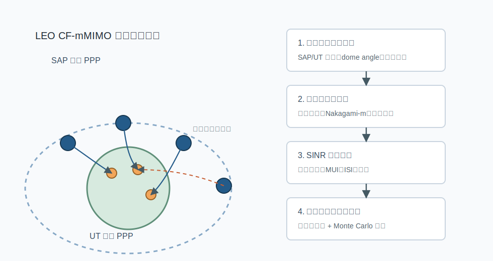
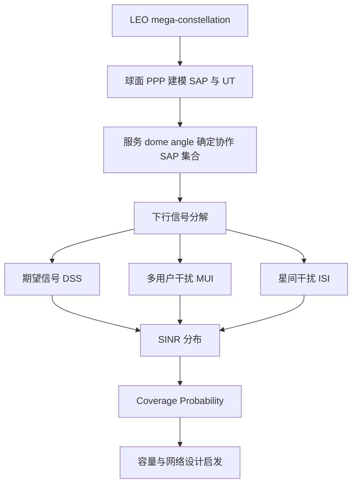

# 从覆盖概率看 LEO 星座中的 Cell-Free Massive MIMO 下行性能

## 1. 论文基本信息

* 英文标题：Downlink Performance of Cell-Free Massive MIMO for LEO Satellite Mega-Constellation
* 中文理解标题：面向 LEO 卫星巨型星座的 Cell-Free Massive MIMO 下行性能分析
* 作者：Xiangyu Li, Bodong Shang
* 期刊/会议：IEEE Transactions on Mobile Computing
* 年份：2025
* DOI：10.1109/TMC.2025.3628390
* IEEE Xplore 链接：https://doi.org/10.1109/TMC.2025.3628390
* 阅读日期：2026-06-15
* 关键词：LEO satellite, cell-free massive MIMO, coverage probability, stochastic geometry, SINR, inter-satellite interference

## 2. 为什么选择这篇论文

这篇论文直接落在 LEO satellite networks 和 cell-free massive MIMO 的交叉点上，而且把问题从“架构是否有吸引力”推进到“下行覆盖概率和系统容量如何定量分析”。对当前研究工作来说，这个角度很重要：如果要讨论 millisecond-level downlink SINR prediction，最终不能只停在预测误差，而要回答预测结果能否改善覆盖概率、容量、服务稳定性和干扰管理。

我选择它还有一个原因：论文使用 stochastic geometry 对 LEO mega-constellation 进行系统级建模，把 satellite access points、ground user terminals、service dome angle、inter-satellite interference、multi-user interference 和 Nakagami-m fading 放进统一框架。这个框架虽然不是学习模型，但它给出了一个很清楚的系统指标链条：空间分布决定链路距离，链路距离和信道统计决定 SINR，SINR 再决定 coverage probability 和 capacity。

它与当前 LEO satellite cell-free massive MIMO 方向的关系比单纯的 beamforming 或 routing 论文更直接。论文关心的是多颗卫星协同服务用户时，服务范围扩大和干扰增加之间怎样权衡。这正是 SINR prediction 和 interference-aware message passing 需要面对的问题：预测模型不仅要估计某条链路，还要理解服务簇、邻近卫星和其他用户共同造成的干扰环境。

## 3. 论文要解决的问题

传统 LEO SatCom 通常可以理解为一个用户主要连接一颗卫星，邻近卫星的重叠覆盖更多表现为干扰来源。这样的 cell-based 架构在服务边界处容易遇到 inter-satellite interference，用户覆盖概率和数据率会随位置、星座几何和波束重叠而波动。Cell-free massive MIMO 的想法是让多个分布式接入点在同一时频资源上协同服务用户，从而弱化小区边界或卫星服务边界。

问题在于，把 CF-mMIMO 搬到 LEO mega-constellation 后，系统不再是一个小范围地面网络。卫星和用户分布在两个球面上，链路距离跨度大，服务范围受 dome angle 影响，非服务卫星仍会带来下行干扰。仅靠系统级仿真可以观察趋势，但很难快速解释哪些参数决定覆盖概率，也不利于大规模星座设计。

因此，作者要解决的核心问题是：如何为 LEO satellite CF-mMIMO 下行网络建立可分析的系统模型，并推导覆盖概率、干扰和容量随关键参数变化的规律。这里的关键参数包括 Nakagami fading 参数、卫星接入点数量、用户数量、轨道高度和服务 dome angle。论文不是提出一个新的深度学习模型，而是提供系统级性能分析工具。

## 4. 系统模型和关键假设

论文考虑下行 CF-mMIMO LEO SatCom 网络。多个 satellite access points 同时服务地表上的 user terminals，SAP 与 UT 的空间位置分别建模在两个同心球面上。作者用 homogeneous spherical Poisson point processes 描述卫星和用户的随机分布，并将这一抽象与实际星座的随机初始状态进行比较，用来说明 PPP 模型可以捕捉平均性能趋势。

在架构上，SAP 通过高速 optical inter-satellite links 与 central server 交换控制信息，从而支持协同传输。central server 可以理解为具备较强计算和协调能力的中心节点。每个 UT 根据服务范围选择可服务的 SAP 集合，服务范围由 dome angle 决定。dome angle 越大，用户可见或可协作的卫星集合越大，期望信号可能增强，但 signaling overhead 和多用户干扰也会增加。

信道方面，论文同时考虑大尺度路径损耗和小尺度 Nakagami-m fading。天线主瓣、旁瓣增益差异也会影响 desired signal strength 和 inter-satellite interference。接收端的 SINR 被拆成期望信号、multi-user interference、inter-satellite interference 和噪声。这个拆分很适合后续做预测模型，因为它说明 SINR 不是一个孤立标量，而是由服务簇内外多种空间关系共同决定。

论文还讨论了 CSI 假设。为了推导覆盖概率，后续分析主要采用 perfect CSIT；同时作者用数值结果说明，当 pilot resources 足够时，估计误差对 desired signal strength 的影响会变小。这个假设有助于解析推导，但对真实 LEO 系统仍然偏理想，因为 channel aging、residual Doppler 和反馈时延会让可用 CSI 与真实下行信道存在偏差。

## 5. 方法概述

论文的方法主线是“球面随机几何建模 + SINR 统计分析 + 覆盖概率推导 + Monte Carlo 验证”。第一步，作者把 SAP 和 UT 的位置建模为两个球面 PPP，得到典型用户与服务卫星之间的距离关系，并刻画每个 SAP 平均服务的用户数量。

第二步，论文根据下行传输模型拆解信号项。对典型用户来说，来自服务 SAP 的相干传输形成 desired signal strength；同一服务集合中面向其他用户的信号造成 multi-user interference；服务集合外的非协作卫星造成 inter-satellite interference。这样的分解使覆盖概率分析不只依赖平均路径损耗，而是把 CF-mMIMO 协作收益和网络级干扰放在同一表达式里。

第三步，作者推导 desired signal strength 的分布、平均 ISI、平均 MUI，并在 Nakagami-m fading 条件下给出 coverage probability 的近似表达式。这里用到的一个关键近似是把聚合干扰看成围绕均值集中，这在大量独立干扰源存在时可以用大数定律直觉解释。最后，论文通过 Monte Carlo simulation 验证解析表达式，并比较 PPP 模型、随机初始状态 Starlink-like 星座和固定初始状态星座的差异。

与纯优化类论文相比，这篇论文的贡献不在于求一个最优 beamforming 矩阵，而在于给出可解释的系统级规律。它告诉读者：服务范围、卫星数量、轨道高度、用户密度和 fading 条件如何影响覆盖概率和容量。这种规律可以作为后续学习式 SINR prediction 或 resource allocation 的评价基准。

## 6. 关键公式或机制理解

第一个关键机制是 SINR 分解。论文中典型用户的 SINR 可以概括为：

```text
SINR = desired signal power / (multi-user interference + inter-satellite interference + noise)
```

这个形式看起来常见，但在 LEO CF-mMIMO 场景里每一项都有特殊含义。desired signal power 来自多个协作 SAP；MUI 来自同一资源块内服务其他 UT 的信号；ISI 来自非协作卫星或邻近覆盖区的下行泄漏；噪声则与接收机和带宽有关。它对整篇论文的作用是把覆盖概率和系统几何联系起来。

第二个关键机制是 coverage probability。覆盖概率可以理解为：

```text
P(SINR > gamma_th)
```

其中 gamma_th 是解码或服务质量所需的 SINR 门限。对当前研究工作来说，coverage probability 比单点 SINR 更像系统级指标。如果预测模型能更准确地估计未来 SINR，就可以服务于调度、波束选择和功率控制，进而影响超过门限的用户比例。

第三个关键机制是 service dome angle。dome angle 决定一个 UT 可以纳入多少 SAP 作为协作服务集合。角度变大时，潜在协作卫星增多，期望信号可能增强；但同一网络中的服务重叠、MUI、信令开销和调度复杂度也会上升。论文的价值在于没有把“更多协作”简单等同于“更好性能”，而是分析这种参数带来的权衡。

## 7. 原创图解：论文方法或系统框架



图 1：根据论文思路重新绘制的 LEO CF-mMIMO 下行覆盖概率分析框架，表达 SAP/UT 空间建模、SINR 分解和覆盖概率验证之间的关系，非论文原图。



这张图强调论文的分析路径。对当前研究工作来说，它也提示 IA-MPNN 可以围绕“服务集合内协作”和“服务集合外干扰”分别设计消息传递边，而不是把所有邻居统一视作同一种干扰源。

## 8. 实验设置与结果理解

论文实验主要用 Monte Carlo simulation 验证解析表达式，并研究关键网络参数对覆盖概率和容量的影响。实验首先比较 PPP 模型、随机初始状态的 Starlink-like constellation 和固定初始状态星座。结果显示，PPP 模型虽然抽象，但能较好捕捉随机初始状态星座的平均性能趋势；固定初始状态由于几何结构更规则，与 PPP 的差距会更明显。

论文还比较了不同 Nakagami fading 参数下的 coverage probability。更强的 LoS 效应通常有利于覆盖概率提升，这符合 LEO 星地链路中直视路径较强的物理直觉。对当前研究而言，这说明 fading 统计不能只作为仿真背景参数，而应成为解释模型误差和鲁棒性的因素。

服务 dome angle 是实验中很值得关注的变量。作者指出，更大的服务范围可以带来更强 desired signal，但也会引入更多协作、信令和干扰相关代价。实验结论整体表明，更大的服务范围可能提升覆盖概率，但并不意味着系统设计可以无限扩大协作范围。对 CF-mMIMO 来说，服务簇大小需要和计算、回传、同步和干扰控制一起考虑。

用户数量和系统容量之间也存在权衡。论文观察到在不同轨道高度和 dome angle 下，存在使系统容量较优的用户数量；同时，随着用户数量增加，per-user capacity 会持续下降。这一点对 SINR prediction 很有启发：预测模型如果只优化平均误差，可能掩盖高负载场景下用户间干扰急剧变化的问题。

## 9. 对我自己论文的启发

对 LEO 卫星网络建模的启发是：论文把星座几何写成性能分析的起点，而不是背景图。当前研究工作如果讨论 LEO satellite cell-free massive MIMO，也应明确卫星、用户、服务集合和邻近干扰源的空间关系。这样 SINR prediction 才不是普通时间序列回归，而是面向高速空间网络的链路级预测。

对 cell-free massive MIMO 的启发是：协作收益和协作代价必须同时出现。论文用 dome angle 表达服务范围，说明可服务 SAP 变多时，期望信号和干扰项会一起变化。当前研究可以把 serving cluster 的大小、卫星可见性、用户关联关系作为图结构的一部分，让 IA-MPNN 学习“哪些协作边有用，哪些邻接边主要带来干扰”。

对 SINR prediction 的启发是：SINR 应该被解释为系统结构的结果，而不是模型输出的黑箱数字。论文把 SINR 分解为 DSS、MUI、ISI 和噪声，这为预测任务提供了可解释拆分。后续可以考虑让模型分别编码服务链路强度、簇内用户干扰和簇外卫星干扰，再汇聚为未来 SINR。

对 channel aging 和 residual Doppler 的启发是：这篇论文为了可分析性采用相对稳定的统计框架，主要关注空间分布和 fading 统计；但真实 LEO 下行链路还会受到高速运动带来的 CSI aging 与 residual Doppler 影响。当前研究工作的优势可以放在这里：在已有覆盖概率分析揭示空间规律后，进一步补上毫秒级时间动态和预测问题。

对 interference-aware message passing 的启发是：消息传递图可以从论文的干扰分解中获得结构先验。服务 SAP 到目标 UT 的边可以表达 desired signal；服务 SAP 到其他 UT 的边可以表达 MUI；非服务 SAP 到目标 UT 的边可以表达 ISI；时间边可以表达 channel aging。这样构图比单纯 k-nearest neighbors 更贴近通信机理。

对 CP、MAE、latency 等实验指标的启发是：coverage probability 可以作为 MAE 之外的系统指标。当前研究如果只报告 SINR MAE，审稿人可能会问预测误差降低是否真的改善通信性能。可以进一步报告在给定 SINR threshold 下的 CP 改善、不同用户密度下的 CP 稳定性、以及毫秒级推理 latency 是否足以服务在线调度。

对 IEEE TVT 审稿意见回复的启发是：这篇论文的写法强调“参数变化 -> SINR 组成变化 -> 覆盖概率变化 -> 网络设计结论”。当前研究在回复审稿意见时，也可以沿着这个链条解释实验：为什么选择这些参数，为什么这些参数会影响预测，预测提升如何传导到系统级指标。

对后续实验或论文表述的启发是：可以把 IA-MPNN 的实验场景设计成多个 dome angle、用户密度、轨道高度或残余 Doppler 条件组合，而不是只固定一个场景。这样既能验证泛化性，也能让论文更接近 LEO CF-mMIMO 系统设计问题。

## 10. 这篇论文的优点

1. 选题直接面向 LEO satellite mega-constellation 中的 CF-mMIMO 下行性能，和 NTN 系统设计关系紧密。
2. 使用球面 stochastic geometry 建模 SAP 与 UT 分布，避免只依赖单一仿真场景。
3. 将 SINR 拆分为 desired signal、MUI、ISI 和 noise，物理含义清晰。
4. 围绕 coverage probability 和 capacity 给出参数级设计启发，适合支撑后续网络规划。
5. 对 PPP 模型和 Starlink-like constellation 做比较，增强了建模假设的说服力。

## 11. 这篇论文的局限

1. 为了推导可处理的解析表达式，模型对 CSI 和干扰统计做了理想化或平均化处理。
2. 论文重点是覆盖概率分析，没有深入处理 beamforming、power allocation 或在线调度算法。
3. Channel aging、residual Doppler 和星座拓扑随时间变化的问题没有作为核心动态模型展开。
4. OISL、central server 和协同传输带来的控制开销主要停留在架构假设层面。
5. 聚合干扰均值近似有助于分析，但在极端稀疏、突发业务或强相关星座分布下可能需要重新验证。

## 12. 我可以借鉴的写作句式或结构

这篇论文的问题引入方式值得学习。它不是先说“LEO 很重要”，而是先说明传统 LEO 多波束或 cell-based 服务存在边界干扰，再引出 CF-mMIMO 能缓解边界问题，最后指出大规模星座需要系统级可分析模型。这种引入路径清楚地把研究动机落在一个具体瓶颈上。

related work 的组织也比较稳：先综述 LEO satellite coverage 和 stochastic geometry，再综述 terrestrial CF-mMIMO，最后收束到 LEO CF-mMIMO 的研究空白。当前研究工作可以借鉴这种分层方式，把 LEO dynamics、cell-free massive MIMO、SINR prediction、GNN/MPNN 分成相互递进的几组，而不是把所有相关工作混在一起。

contribution 写法可以学习它的“模型、分析、设计启发”三段式。对 IA-MPNN 论文来说，可以对应写成：构建面向 LEO CF-mMIMO 的时空干扰图；提出毫秒级 SINR prediction 方法；通过 MAE、CP、latency 和消融实验给出系统启发。

实验叙述方面，论文不是只展示曲线，而是把每条曲线和网络参数解释联系起来。当前研究工作也应避免只说“模型 A 优于模型 B”，而要解释为什么在高 Doppler、高用户密度或更大服务簇下提升更明显或更困难。

## 13. 后续可以继续追的问题

1. 如何把这类 coverage probability 分析和毫秒级 SINR prediction 结合，形成预测驱动的 CP 评估？
2. LEO CF-mMIMO 的服务 dome angle 是否可以由 IA-MPNN 根据未来 SINR 动态调整？
3. 在 residual Doppler 和 CSI aging 存在时，论文中的 perfect CSIT 假设会对覆盖概率产生多大偏差？
4. 服务簇内 MUI 与簇外 ISI 是否应该在图神经网络中使用不同类型的边和消息函数？
5. 如何把 OISL signaling overhead、central server 计算时延和预测 latency 放进同一个系统级指标？

## 14. 一句话总结

这篇论文的价值在于，它用可解释的随机几何框架把 LEO CF-mMIMO 的空间协作、干扰组成、SINR 和覆盖概率串起来，为当前研究中的干扰感知 SINR 预测提供了系统级评价参照。

## 15. 引用信息

IEEE 风格引用草稿，需要人工核对卷期、页码和 Early Access 状态：

X. Li and B. Shang, "Downlink Performance of Cell-Free Massive MIMO for LEO Satellite Mega-Constellation," IEEE Transactions on Mobile Computing, early access, doi: 10.1109/TMC.2025.3628390.

BibTeX 草稿，需要人工核对：

```bibtex
@article{li2025downlink,
  title={Downlink Performance of Cell-Free Massive MIMO for LEO Satellite Mega-Constellation},
  author={Li, Xiangyu and Shang, Bodong},
  journal={IEEE Transactions on Mobile Computing},
  year={2025},
  note={Early Access},
  doi={10.1109/TMC.2025.3628390}
}
```
