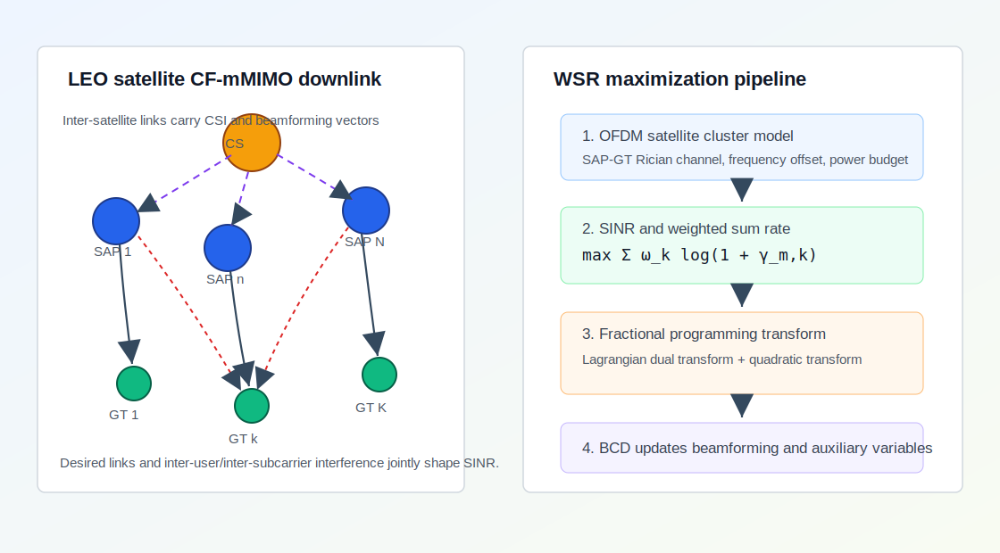
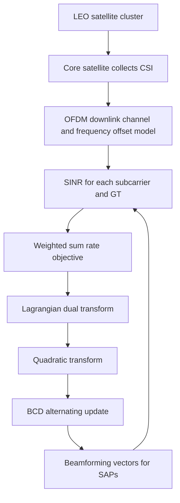

# 从加权和速率最大化看 LEO Cell-Free Massive MIMO 下行波束成形

## 1. 论文基本信息

* 英文标题：Weighted Sum Rate Maximization for Cell Free Massive MIMO Network of LEO Satellite
* 中文理解标题：面向 LEO 卫星 Cell-Free Massive MIMO 网络的加权和速率最大化
* 作者：Mingqi Gao, Shibing Zhu, Sai Xu, Jianmei Dai
* 期刊/会议：IEEE Transactions on Vehicular Technology
* 年份：2026
* DOI：10.1109/TVT.2026.3669895
* IEEE Xplore 链接：https://doi.org/10.1109/TVT.2026.3669895
* 阅读日期：2026-06-16
* 关键词：LEO satellite, cell-free massive MIMO, weighted sum rate, beamforming, OFDM, SINR, fractional programming

## 2. 为什么选择这篇论文

这篇论文直接讨论 LEO satellite cluster 上的 cell-free massive MIMO 下行多用户通信，并把核心问题落到 weighted sum rate maximization。与仅分析覆盖概率的工作相比，它更靠近“如何在给定功率预算下实际形成每颗 satellite access point 的波束成形向量”这一设计层问题。

对当前研究工作来说，这篇论文值得读的地方有三点。第一，它把 LEO CF-mMIMO 架构具体化为 core satellite 与多个 satellite access points 协同服务 ground terminals 的形式，这和面向 LEO satellite cell-free massive MIMO 的系统建模高度相关。第二，它在 OFDM 下显式考虑 subcarrier frequency offset 导致的干扰，这与 residual Doppler、channel aging 和毫秒级 SINR 变化有自然联系。第三，它使用 Lagrangian dual transform、quadratic transform 和 block coordinate descent，把非凸 WSR 问题改写成可迭代求解的问题，这为后续把优化算法和学习模型结合提供了参照。

这篇论文不是 GNN 或 MPNN 论文，但它对 interference-aware message passing 仍有启发：如果一个学习模型要预测未来下行 SINR，至少应理解服务 SAP、GT、子载波、频偏、干扰功率和波束成形之间的耦合关系。否则模型可能只学到表面相关性，难以解释为什么某些高负载或高频偏场景下误差变大。

## 3. 论文要解决的问题

LEO 卫星网络要支持高数据率、广覆盖和移动接入，单星服务或传统蜂窝式边界会受到覆盖重叠、干扰和频繁切换的限制。Cell-free massive MIMO 的思路是让多个分布式接入点共同服务用户，从而削弱固定小区边界。把这个思路迁移到 LEO 场景后，多个卫星可以形成一个协作簇，由中心节点统一计算波束成形策略，再通过星间链路下发给各个 SAP。

难点在于，LEO 系统不是静态地面网络。卫星高速运动使链路存在频偏和相位变化；多用户共享同一频谱资源时，面向其他用户或其他子载波的信号会形成干扰；卫星平台功率受限，不能简单用更高发射功率掩盖设计不足。因此，作者关注的问题是：在 LEO satellite CF-mMIMO OFDM 网络中，如何在总功率约束下设计下行波束成形矩阵，使系统加权和速率尽可能高。

传统 ZF 和 MMSE beamforming 可以作为基线，但它们不一定适合这个耦合场景。ZF 依赖对干扰的强制消除，可能在条件数较差或用户数变化时牺牲功率效率；MMSE 折中噪声和干扰，但没有直接以 WSR 为目标。论文的目标是针对 WSR 目标构造一个可求解的优化流程，并通过仿真验证它相对于传统波束成形方法的增益。

## 4. 系统模型和关键假设

论文考虑一个基于 OFDM 的 LEO satellite CF-mMIMO 下行系统。卫星簇中包含一个 core satellite 和多个 satellite access points。core satellite 负责后端协调和波束成形矩阵计算，SAP 负责射频接入和面向地面终端的下行发送。每个 GT 配备接收天线，所有 SAP 在覆盖区域内协同服务 GT。

信道模型采用 Rician fading，用 LoS 和 NLoS 分量描述 SAP-GT 链路。大尺度衰落包含距离损耗、阴影衰落和由 boresight angle 引起的天线方向性退化。这样的建模比只写路径损耗更细，因为 LEO 下行链路通常 LoS 较强，但用户位置、波束指向和卫星几何仍会带来明显差异。

在 OFDM 传输中，论文考虑频率偏移对接收信号的影响。频偏会让目标子载波上的信号被 sinc 项缩放，同时把其他子载波的能量泄漏成 inter-carrier interference。作者将干扰功率整理为与频偏相关的形式，并据此构造每个子载波、每个用户的 SINR。这个处理对 LEO 场景尤其重要，因为 residual Doppler compensation 不完美时，频偏不只是同步细节，而会直接影响下行 SINR。

优化目标是所有用户和子载波上的 weighted sum rate，约束是每个 SAP 或系统的总发射功率预算。用户权重用于表达不同 GT 的服务优先级。论文的仿真中主要设置为等权重，但该框架本身允许扩展到 QoS-aware 或 fairness-aware 调度。

## 5. 方法概述

论文的方法可以概括为“先建 SINR，再重写 WSR，最后交替优化”。原始问题中，目标函数包含多个 `log(1 + SINR)` 项，而 SINR 又是期望信号功率与干扰加噪声功率之比。由于波束成形矩阵同时影响分子和分母，问题是非凸的，不能直接用简单凸优化一次求出全局最优。

第一步，作者使用 Lagrangian dual transform，引入辅助变量 `alpha`，把对数和分式耦合拆开。这个变换的作用不是改变目标含义，而是让 WSR 目标进入更容易迭代处理的形式。

第二步，作者使用 quadratic transform，引入另一个辅助变量 `beta`，把分式项改写成二次形式。这样做的直觉是把“信号功率 / 干扰功率”这种难处理结构转成关于辅助变量和波束向量的可交替优化表达。

第三步，论文采用 block coordinate descent。给定波束成形矩阵时，辅助变量可以用闭式表达更新；给定辅助变量时，波束成形矩阵对应的问题可以转化为凸优化形式求解。整个算法在这些变量之间循环更新，直到达到迭代上限或收敛条件。

与端到端学习方法相比，这种优化方法可解释性强：每一步都对应通信目标函数的一个变换或变量更新。与传统 ZF/MMSE 相比，它更直接面向 WSR，而不是把干扰抑制或均方误差作为替代目标。

## 6. 关键公式或机制理解

第一个关键机制是 OFDM 频偏下的接收信号。论文中，目标子载波的有效信号会受到 `sinc(pi epsilon)` 相关因子的影响，其他子载波会通过频偏泄漏到当前子载波。这里的 `epsilon` 是归一化频率偏移。它的作用是把 residual Doppler 或同步误差从“链路实现问题”转成“速率优化问题”的一部分。

第二个关键机制是 SINR。论文可理解为：

```text
gamma_m,k = useful power on subcarrier m for user k
            / (inter-carrier and multi-user interference + noise)
```

其中 `m` 表示子载波，`k` 表示用户。波束成形矩阵既决定有用信号强度，也决定对其他用户或子载波的干扰泄漏。因此，SINR prediction 如果要用于这种网络，输入特征不能只包含单条链路的 channel gain，还应包含邻近用户、SAP 协作簇、子载波间隔和频偏状态。

第三个关键机制是 WSR 目标：

```text
maximize sum_{m,k} omega_k log(1 + gamma_m,k)
```

`omega_k` 是用户权重。这个表达式说明论文优化的不是单个用户峰值速率，而是多用户多子载波系统效用。对当前研究工作来说，它提示未来 SINR 预测也可以服务于 weighted scheduling 或 resource allocation，而不仅是报告一个预测误差。

第四个关键机制是交替优化。`alpha` 更新近似反映当前 SINR 状态，`beta` 更新处理分式结构，波束成形矩阵更新则在功率约束下改善 WSR。这个流程可作为后续“model-driven neural network”或 unrolled optimizer 的参考：每一层可以对应一次 BCD 更新，而图消息传递可以用于快速近似干扰耦合。

## 7. 原创图解：论文方法或系统框架



图 1：根据论文思路重新绘制的 LEO CF-mMIMO 下行 WSR 优化框架，展示 core satellite、SAP、GT、OFDM 干扰和交替优化流程之间的关系，非论文原图。



图 2：论文优化流程的简化逻辑图，强调 WSR、SINR 和波束成形之间的闭环关系，属于原创重绘。

## 8. 实验设置与结果理解

论文使用随机生成的 Rician channel 进行数值仿真，Rician factor 取 3。SAP 数量设置为 8 和 16，用户权重设为 1。系统带宽为 1 MHz，子载波间隔为 15 kHz。卫星轨道高度、载频、SAP 和 GT 天线增益、噪声系数、阴影衰落等参数用于构造 LEO 下行链路场景。优化最大迭代次数设为 100，并设置较严格的可行性与最优性容差。

对比方法包括 ZF、MMSE 和 random beamforming。ZF 与 MMSE 是经典线性波束成形基线；random beamforming 更像一个无优化参考，用来说明只依赖随机方向发送会损失多少速率。

实验首先比较不同发射功率下的 achievable WSR。结果表明，所提优化方法在功率从低到高变化时整体优于传统波束成形方法。论文还比较 SAP 数量为 8 和 16 的情况，显示更多 SAP 可以提供更强协作能力，但也意味着更复杂的干扰管理。

第二组实验考察 16 个 SAP 同时服务不同数量 GT 时，每个用户的可达速率变化。随着接入用户增多，平均速率下降，这符合多用户干扰和功率分摊的直觉。作者指出，在多 GT 场景下，所提波束成形策略相对于次优基线有明显提升。这里我关注的不是某个具体百分比本身，而是趋势：当用户数增加、干扰耦合增强时，面向 WSR 的优化比固定结构波束成形更有价值。

第三组实验研究不同子载波间隔下的 WSR。结果显示，所提方法在子载波间隔变化时仍保持优势，并且能够利用更大的子载波间隔改善系统和速率。这个结论对 LEO residual Doppler 很重要，因为子载波间隔、频偏和 ICI 之间存在直接关系。若后续做 SINR prediction，应该把子载波配置和频偏补偿误差作为场景变量，而不是固定背景参数。

## 9. 对我自己论文的启发

对 LEO 卫星网络建模的启发是：论文把 core satellite、SAP 和 GT 的功能分工写得很清楚。当前研究工作如果使用 LEO satellite cell-free massive MIMO，应明确哪些节点负责计算，哪些节点负责接入，哪些链路承担控制信息。这样才能让毫秒级推理 latency 与实际链路闭环对应起来。

对 cell-free massive MIMO 的启发是：CF-mMIMO 不只是“多颗卫星一起服务一个用户”，更是“多颗 SAP 在同一时频资源上同时服务多个用户”。这意味着 desired signal 和 interference 是同一个协作过程的两面。IA-MPNN 的图结构可以把服务边和干扰边区分开，使模型既看到协作增益，也看到多用户干扰。

对 SINR prediction 的启发是：论文将 SINR 作为 WSR 优化的核心中间量。当前研究可以把预测结果进一步接到 weighted scheduling、beam selection 或 power allocation 上，说明预测不是孤立任务，而是通信优化闭环中的状态估计模块。

对 channel aging 和 residual Doppler 的启发是：论文中归一化频偏 `epsilon` 影响子载波间干扰。真实 LEO 中，即使做了 Doppler compensation，残余频偏和 CSI aging 仍会让当前估计与未来下行 SINR 不一致。因此，当前研究的毫秒级预测可以强调它补偿的是“优化算法输入随时间失配”的问题。

对 interference-aware message passing 的启发是：可以把 SAP-GT 链路、GT-GT 共享资源关系、SAP-SAP 协作关系和子载波关系分别建成不同类型的消息。论文中的 WSR 目标说明，干扰不是局部噪声，而是由所有用户和子载波共同决定。MPNN 的优势正是在这种图耦合中传播上下文。

对 CP、MAE、latency 等实验指标的启发是：除了报告 MAE，还可以把预测 SINR 放进门限判断或速率估计，计算 coverage probability 或 WSR proxy 的改善。latency 指标也可以和 BCD 这类传统优化方法对比：如果深度模型能在毫秒级给出可用预测，就可能为慢速优化器提供初始化或实时校正。

对 IEEE TVT 审稿意见回复的启发是：这篇论文强调“问题非凸 -> 变换 -> 可迭代求解 -> 与 ZF/MMSE 对比”的逻辑链。当前研究在回应审稿人时，也可以把 IA-MPNN 的设计解释为“从通信耦合结构出发，而不是任意套用 GNN”，并用消融实验验证每类边或消息的作用。

对后续实验或论文表述的启发是：可以加入不同子载波间隔、残余频偏、SAP 数量、用户数和功率预算的组合场景。这样实验不仅展示模型平均性能，还展示它在 LEO CF-mMIMO 关键系统参数变化下是否稳定。

## 10. 这篇论文的优点

1. 选题与 LEO satellite CF-mMIMO 下行资源优化高度贴合，问题定义具体。
2. 把 OFDM 频偏引起的干扰纳入 SINR 和 WSR 建模，符合 LEO 高动态场景特点。
3. 使用 fractional programming 和 BCD 将非凸 WSR 问题拆解为可操作的迭代流程。
4. 与 ZF、MMSE 和 random beamforming 对比，基线选择清楚。
5. 实验覆盖发射功率、SAP 数量、GT 数量和子载波间隔等关键参数。

## 11. 这篇论文的局限

1. 论文篇幅较短，对星间链路开销、CSI 获取和中心节点计算时延讨论不充分。
2. 算法中波束成形更新依赖凸优化求解器，实时部署复杂度仍需要进一步评估。
3. 虽然涉及频偏，但没有把卫星轨道动态、channel aging 和 residual Doppler compensation 作为完整时序模型展开。
4. 仿真系统规模相对有限，距离真实 mega-constellation 的大规模用户接入还有差距。
5. 论文没有研究学习式预测或低时延近似算法，因此对毫秒级在线推理只能提供间接启发。

## 12. 我可以借鉴的写作句式或结构

这篇论文的引入方式值得借鉴：先从高数据率、广覆盖和 LEO 网络需求讲起，再过渡到传统 massive MIMO 与 cell-free massive MIMO 的差异，最后收束到 LEO satellite cluster 中的 WSR 优化空白。这样的路径比直接说“我们提出一个算法”更自然。

方法部分的结构也清楚。它先定义系统模型和接收信号，再给出 SINR 与 WSR 目标，随后解释为什么原问题非凸，最后引入变换和交替优化。当前研究工作可以借鉴这种顺序：先写清楚 LEO CF-mMIMO 的图结构和 SINR 形成机制，再引出 IA-MPNN，而不是先介绍神经网络模块。

实验叙述方面，论文把每个图对应一个系统问题：功率变化、用户数量变化、子载波间隔变化。后续写作时也应避免只按模型名称排实验，而应按通信问题组织实验，例如“残余 Doppler 增大时”“服务 SAP 数量变化时”“高负载用户接入时”。

## 13. 后续可以继续追的问题

1. 能否把 BCD 或 fractional programming 的迭代步骤展开成可训练网络，用于快速近似 WSR 优化？
2. IA-MPNN 预测的未来 SINR 能否为本文这类 WSR beamforming 提供初始化或约束校正？
3. residual Doppler 和 channel aging 同时存在时，子载波间干扰项应如何随时间预测？
4. 当 SAP 和 GT 数量扩大到更接近实际星座规模时，中心式波束成形计算是否仍可行？
5. 如何把 WSR、coverage probability、MAE 和 inference latency 放在同一个评估框架中？

## 14. 一句话总结

这篇论文的价值在于，它把 LEO Cell-Free Massive MIMO 下行 SINR、OFDM 频偏干扰和 WSR 波束成形优化连成一条可解释链路，为当前研究中的干扰感知毫秒级 SINR 预测提供了优化目标层面的参照。

## 15. 引用信息

IEEE 风格引用：

M. Gao, S. Zhu, S. Xu, and J. Dai, "Weighted Sum Rate Maximization for Cell Free Massive MIMO Network of LEO Satellite," IEEE Transactions on Vehicular Technology, early access, doi: 10.1109/TVT.2026.3669895.

BibTeX：

```bibtex
@article{gao2026weighted,
  title={Weighted Sum Rate Maximization for Cell Free Massive MIMO Network of LEO Satellite},
  author={Gao, Mingqi and Zhu, Shibing and Xu, Sai and Dai, Jianmei},
  journal={IEEE Transactions on Vehicular Technology},
  year={2026},
  note={Early Access},
  doi={10.1109/TVT.2026.3669895}
}
```
