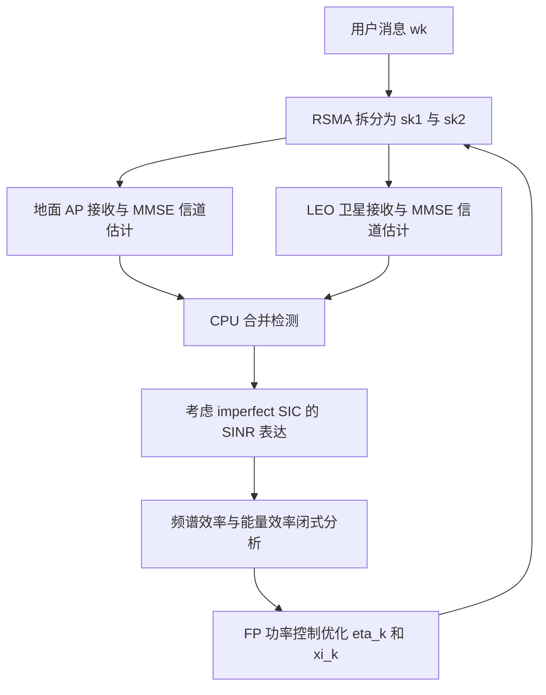

# 从 RSMA 看星地融合 Cell-Free Massive MIMO 的能效优化

## 1. 论文基本信息

* 英文标题：Improving Integrated Satellite-Terrestrial Cell-Free Massive MIMO Systems by Rate-Splitting Multiple Access
* 中文理解标题：用 RSMA 提升星地融合 Cell-Free Massive MIMO 系统的频谱效率与能量效率
* 作者：Yao Zhang, Jintao Shen, Xiaofeng Lin, Meilin Li, Yaoqi Sun, Xichun Sheng, Haitao Zhao, Hongbo Zhu
* 期刊/会议：IEEE Internet of Things Journal
* 年份：2025
* DOI：10.1109/JIOT.2025.3525730
* IEEE Xplore 链接：https://doi.org/10.1109/JIOT.2025.3525730
* 阅读日期：2026-06-17
* 关键词：IST-CF-mMIMO、LEO satellite、RSMA、uplink、spectral efficiency、energy efficiency、imperfect CSI、imperfect SIC

## 2. 为什么选择这篇论文

这篇论文直接讨论 integrated satellite-terrestrial cell-free massive MIMO，也就是把地面 AP、LEO 卫星和中心处理节点放在同一个协作接收框架里分析。它不是单纯介绍 NTN 架构，而是进一步引入 rate-splitting multiple access (RSMA)，推导上行频谱效率和能量效率，并把用户功率控制系数设计成能效优化问题。

它和当前研究方向的连接点主要有三层。第一，论文把 LEO satellite link 与 terrestrial CF-mMIMO link 同时建模，适合观察星地协作对 SINR 与干扰项的影响。第二，RSMA 的“部分解码、部分当噪声处理”本质上是一种干扰管理机制，可以启发 interference-aware message passing 如何表达可解码干扰与残余干扰。第三，论文明确比较 spectral efficiency、energy efficiency 和算法复杂度，这对讨论 millisecond-level inference 的收益和代价很有参考价值。

## 3. 论文要解决的问题

传统 terrestrial CF-mMIMO 能通过分布式 AP 消除小区边界效应，但覆盖范围仍受地面基础设施限制；LEO 卫星能扩大覆盖，却会带来链路损耗、移动性、回传和能耗压力。把二者合并成 IST-CF-mMIMO 后，系统能获得更多观测分支和宏分集，但也会出现更复杂的多用户干扰、导频污染、CSI 不完美以及中心处理复杂度。

作者关注的问题是：在上行 IST-CF-mMIMO 系统中，如果用户采用 RSMA，把一个消息拆成两路数据流发给地面 AP 和 LEO 卫星，那么系统的可达频谱效率与能量效率如何刻画？进一步地，如何选择两路数据流的功率控制系数，使系统能量效率更高，同时避免使用过重的优化算法？

这不是一个只靠增加卫星或 AP 数量就能解决的问题。卫星链路可以改善覆盖和频谱效率，但卫星侧功耗较高；RSMA 可以增强干扰管理，但需要 SIC，且实际 SIC 不可能完美。论文的价值在于把这些因素放到同一个可计算模型里，而不是只给出架构层面的判断。

## 4. 系统模型和关键假设

论文研究上行 RSMA-aided IST-CF-mMIMO 系统，系统包含多个多天线地面 AP、一个多天线 LEO satellite、多个单天线用户以及一个 CPU。AP 和卫星分别接收用户上行信号，并把经过本地信道估计和接收处理后的信息送到 CPU，CPU 再进行合并检测和 SIC。

信道方面，作者同时考虑 AP-user 和 satellite-user 链路，并采用空间相关 Rician fading。这个设定贴合 LEO/星地融合场景：LoS 分量较强，但非视距成分、阴影衰落和空间相关性仍会影响接收质量。每个 coherence interval 开始时，用户向 AP 与卫星发送导频；AP 与卫星使用 MMSE channel estimation，后续推导显式考虑 imperfect CSI。

RSMA 传输中，每个用户的消息被拆成两个独立部分，对应两个数据流。两个数据流的功率控制系数记为 eta_k 和 xi_k，并满足功率约束。CPU 按顺序解码两路数据流，并用 SIC 消除已解码部分。论文没有假设 SIC 完美，而是把 imperfect SIC 引入后续频谱效率推导，这一点比很多理想化 RSMA 分析更接近实际系统。

## 5. 方法概述

论文的方法路线可以概括为“建模、闭式分析、能效优化、仿真验证”四步。

第一步，作者建立 RSMA-aided IST-CF-mMIMO 上行模型。用户同时面向地面 AP 和 LEO satellite 发射，AP 与卫星进行信道估计并把信息送到 CPU。第二步，作者使用 use-and-then-forget (UatF) bounding technique，为两路 RSMA 数据流分别推导可达频谱效率下界，再得到用户总频谱效率和系统 sum spectral efficiency。第三步，作者建立包括用户发射功率、AP 电路功耗、卫星功耗和回传功耗在内的总功耗模型，从而得到 energy efficiency。第四步，作者把用户功率控制系数 eta_k 和 xi_k 的选择转化为能效最大化问题，并使用 fractional programming (FP)，结合 Lagrangian dual transformation 和 quadratic transformation，构造低复杂度迭代算法。

从算法意义看，这篇论文没有用 GNN 或 MPNN，但它给出了一个很适合作为学习式方法对照的优化基线：目标明确，变量是每个用户两路流的功率分配，约束简单，核心困难来自分式 SINR、对数速率和能效目标之间的耦合。

## 6. 关键公式或机制理解

第一个关键机制是 RSMA 的消息拆分。用户 k 的消息被拆成两路数据流，分别由 eta_k 和 xi_k 控制功率。这样做的作用不是简单增加一路传输，而是让接收端可以把一部分干扰解码并消除，另一部分仍作为噪声处理。对多用户上行场景来说，这相当于在 SDMA 和 NOMA 之间提供了更灵活的干扰管理方式。

第二个关键机制是频谱效率下界。论文用 UatF 思路，把期望信道增益作为可确定部分，把波束不确定性、残余 SIC 干扰、其他用户干扰和噪声放进 SINR 分母。这样得到的表达式虽然复杂，但优点是可计算、可用于系统级仿真，也能直接嵌入能效优化。

第三个关键机制是能效目标。系统能量效率可以理解为 EE = R_sum / P_tot，其中 R_sum 是所有用户两路 RSMA 数据流的总频谱效率，P_tot 包括用户发射功率、AP 侧功耗、卫星侧功耗以及回传相关功耗。这个表达式提醒我们：引入卫星链路并不自动提升能效。卫星可能提升 R_sum，但如果额外功耗太高，EE 未必同步改善。

## 7. 论文方法或系统框架

图 1：RSMA-aided IST-CF-mMIMO 上行系统框架，展示用户消息拆分、地面 AP 与 LEO 卫星协作接收、CPU 合并检测和 FP 功率控制闭环。

## 8. 实验设置与结果理解

论文仿真在一个平方区域内放置地面 AP，LEO 卫星位于固定三维坐标，地面链路使用 COST 321 Walfish-Ikegami 相关模型，卫星链路考虑距离、载频、天线增益和阴影衰落等因素。作者比较了 Sat、Ter 和 Sat-Ter 三类系统，也比较了 RSMA 与 SDMA。

实验首先验证闭式频谱效率表达式与 Monte Carlo 仿真的一致性。结果显示，理论曲线和仿真点吻合较好，说明推导的频谱效率表达式可以用于后续系统分析。随后，论文展示 Sat-Ter 协作系统在频谱效率上优于单独 terrestrial 或 satellite 系统，原因是 CPU 能对来自 AP 与卫星的多路观测进行合并，获得宏分集收益。

RSMA 与 SDMA 的比较也很关键。论文指出，RSMA 在频谱效率和能量效率上整体优于 SDMA，且用户数增加时，RSMA 的干扰管理优势更明显。随着 AP 数量或 AP 天线数增加，频谱效率通常提升；但能效表现更复杂，因为卫星侧功耗和 AP 增加带来的电路功耗会改变分母。论文还给出 FP-based power control 与 SCA、FPC、HFPC 等方法的比较，结论是 FP 方法能获得更高能效，并显著降低运行时间。这里我只记录论文公开描述的趋势，不编造未核对的额外数值。

## 9. 对我自己论文的启发

对 LEO 卫星网络建模的启发是，LEO 链路不应只作为“覆盖增强项”放进模型，而应与地面分布式接入点一起进入 SINR 分解。当前研究工作如果强调 LEO satellite cell-free massive MIMO，可以借鉴这种 Sat-Ter 分支的写法：分别定义地面链路、卫星链路、合并接收和中心处理，再讨论协作带来的增益与代价。

对 cell-free massive MIMO 的启发是，AP 数量增加带来宏分集收益，但也引入前传、同步、功耗和计算复杂度。论文的能效分析提醒我，不能只报告 CP 或 MAE，还应解释为什么某种低复杂度推理方法不会因为额外计算/通信开销而抵消系统收益。

对 SINR prediction 的启发更直接。论文把 SINR 分母拆成波束不确定性、残余 SIC 干扰、其他用户干扰和噪声等部分，这种“分项干扰观”可以迁移到 interference-aware message passing。对于 Millisecond-Level Downlink SINR Prediction，MPNN 的边特征不应只包含几何距离或信道增益，还可以表达邻接用户/卫星之间的干扰关系、可预测残余 Doppler 影响以及 channel aging 造成的 CSI 偏差。

对 channel aging / residual Doppler 的启发是，虽然这篇论文没有把 Doppler aging 作为主问题，但它已经把 imperfect CSI 放进闭式分析。当前工作可以进一步强调：在 LEO 高速运动场景下，CSI 不完美不只是估计噪声，还来自时间演化、残余 Doppler 和预测延迟。因此，毫秒级 SINR 预测的价值在于提前补偿这种动态失配，而不是简单替代传统估计。

对 interference-aware message passing 的启发是，RSMA 的“先解码一部分、残余部分仍为干扰”提供了一种干扰可分解视角。MPNN 可以把不同类型干扰作为不同边或不同消息通道处理，例如可协作消除的干扰、不可消除的同频干扰、由 CSI 老化引入的不确定项。这样写比笼统说“GNN 学习干扰关系”更有说服力。

对实验指标的启发是，除了 MAE 和 latency，可以考虑补充 CP、tail error、不同用户密度下的推理稳定性，以及在不同信道老化强度下的性能退化曲线。对 IEEE TVT 审稿意见回复来说，这篇论文也提醒我：如果审稿人质疑工程可行性，应把模型假设、复杂度、时延和可部署性分开回应，而不是只强调预测精度。

## 10. 这篇论文的优点

1. 系统模型把 terrestrial CF-mMIMO 与 LEO satellite link 放在统一上行框架里，研究对象清晰。
2. 同时考虑 Rician fading、imperfect CSI 和 imperfect SIC，比完美 CSI/SIC 假设更稳健。
3. 不只分析 spectral efficiency，还引入 energy efficiency，有助于评价卫星协作的真实代价。
4. FP-based power control 算法针对 RSMA 两路数据流功率分配，变量含义明确，适合作为基线方法。
5. 实验比较 Sat、Ter、Sat-Ter 以及 RSMA、SDMA，能较清楚展示协作架构和多址机制的差异。

## 11. 这篇论文的局限

1. 论文主要关注上行，和下行 SINR prediction、beamforming 或用户调度之间还需要进一步连接。
2. LEO 卫星运动导致的快速时变、Doppler aging 和服务窗口变化没有成为主要建模对象。
3. 能效优化变量集中在用户功率控制系数，对 AP/卫星选择、动态 clustering 和回传约束讨论较少。
4. FP 算法虽然复杂度低于 SCA，但仍属于迭代优化，和毫秒级在线推理之间存在部署时延差距。
5. 仿真环境仍是模型驱动，真实星座、真实业务负载和终端硬件限制可能带来额外偏差。

## 12. 我可以借鉴的写作句式或结构

这篇论文的引言组织方式值得学习：先说明 CF-mMIMO 对 6G 的价值，再指出 LEO satellite 可以扩展覆盖，随后引入 RSMA 作为干扰管理工具，最后自然提出 RSMA-aided IST-CF-mMIMO 的研究空白。这个结构适合当前论文写作中从 LEO、CF-mMIMO、SINR prediction 和 IA-MPNN 逐层收束问题。

贡献陈述也比较清楚：第一条讲系统建模与闭式表达式，第二条讲优化问题和算法，第三条讲仿真验证。当前研究工作也可以采用类似结构，把“预测模型”“干扰感知消息传递机制”“毫秒级复杂度与实验验证”分成相互支撑的贡献，而不是把所有创新点挤在一个段落里。

实验叙述方面，论文先验证理论表达式，再做机制比较，最后分析优化算法收敛与复杂度。这种顺序有助于建立可信度。当前论文如果回应审稿意见，也可以先验证仿真或预测设置可靠，再比较 baseline，最后讨论复杂度和 latency。

## 13. 后续可以继续追的问题

1. 如何把 LEO 轨道运动、channel aging 和 residual Doppler 显式加入 IST-CF-mMIMO 的 SINR 分解？
2. RSMA 的干扰分解思想能否转化为 MPNN 中不同类型边消息的设计？
3. 在 Sat-Ter 协作系统中，能效最优和 SINR 预测误差最小是否存在冲突？
4. 如果要求毫秒级在线决策，FP/SCA 这类迭代优化能否被轻量神经网络近似？
5. CP、MAE、latency 和 energy efficiency 能否构成统一的实验评价表，而不是分散在不同章节？

## 14. 一句话总结

这篇论文的价值在于把 LEO 卫星、terrestrial cell-free massive MIMO、RSMA 干扰管理和能效优化放到同一个可计算框架中，为后续做 interference-aware SINR prediction 提供了清晰的干扰分解和复杂度对照。

## 15. 引用信息

Y. Zhang, J. Shen, X. Lin, M. Li, Y. Sun, X. Sheng, H. Zhao, and H. Zhu, "Improving Integrated Satellite-Terrestrial Cell-Free Massive MIMO Systems by Rate-Splitting Multiple Access," IEEE Internet of Things Journal, vol. 12, no. 10, pp. 14269-14280, May 2025, doi: 10.1109/JIOT.2025.3525730.
