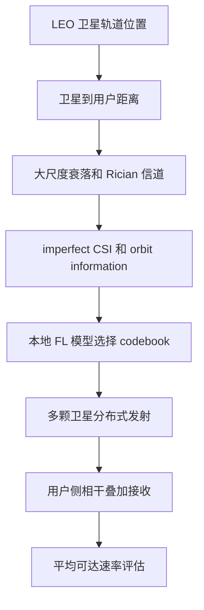
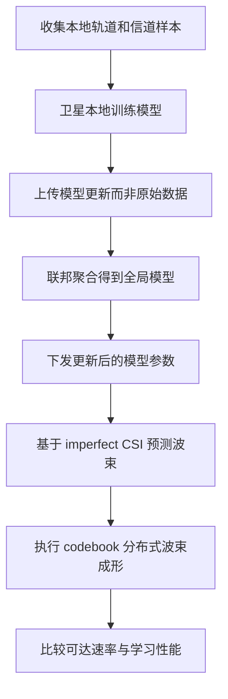

# 从联邦学习分布式波束成形看 LEO 卫星协作通信

## 1. 论文基本信息

* 英文标题：Federated Learning Aided LEO Satellite Communications: A Distributed Beamforming Approach
* 中文理解标题：用联邦学习辅助 LEO 卫星分布式波束成形
* 作者：Tianwei Hou, Zhengyu Song, Jun Wang, Wenfei Gong, Anna Li, Arumugam Nallanathan
* 期刊/会议：IEEE Internet of Things Journal, Vol. 12, No. 16
* 年份：2025
* DOI：10.1109/JIOT.2025.3573222
* IEEE Xplore 链接：https://doi.org/10.1109/JIOT.2025.3573222
* 阅读日期：2026-06-18
* 关键词：LEO satellite communications、distributed beamforming、federated learning、imperfect CSI、beamforming prediction、achievable rate

## 2. 为什么选择这篇论文

这篇论文虽然不是直接以 cell-free massive MIMO 命名，但它处理的问题与 LEO satellite cell-free massive MIMO 很接近：多个 LEO 卫星同时面向地面用户协作发射，通过分布式波束成形提升接收信号质量。区别在于，作者没有假设一个低时延、全局可用的中心控制器，而是把 federated learning 放到每颗卫星上，让卫星基于本地信息选择合适的 codebook，从而避免大尺度星间通信时延对集中式波束成形的限制。

它值得读的原因主要有三点。第一，它把 LEO 多星协作从“架构设想”推进到具体的 distributed beamforming 问题，对理解多卫星联合服务用户很有帮助。第二，论文显式讨论 imperfect CSI 和 orbit information，这与 LEO 场景中的 channel aging、残余 Doppler 和预测式 CSI 更新高度相关。第三，作者用学习方法解决波束选择，但目标仍然落在 achievable rate 上，这对当前研究工作中把 IA-MPNN 输出映射到 SINR、CP、MAE 和 latency 等指标很有启发。

## 3. 论文要解决的问题

LEO 卫星通信的基本矛盾是覆盖能力强，但单星到地面用户的距离远、路径损耗大，导致接收信号质量受限。提高发射功率或扩大带宽可以缓解这个问题，但对卫星平台来说并不经济，也不一定能满足能效约束。多颗卫星协作发射可以把分散在空间中的天线资源组织起来，让地面用户接收到相干叠加后的信号，这是 distributed beamforming 的核心价值。

传统集中式波束成形在地面网络中比较自然，因为基站之间回传链路短，中心节点可以收集较完整的 CSI。LEO 场景不同：卫星之间距离远、传播时延大、拓扑随轨道运动变化，完美 CSI 很难及时获得。如果仍然依赖一个集中式控制器实时计算所有卫星的预编码矩阵，算法在论文仿真中可能成立，在真实系统中却很难跟上星座动态。

作者要解决的问题就是：在多个 LEO 卫星协作服务一个地面用户时，怎样用联邦学习和 codebook-based distributed beamforming，在不依赖完美集中式 CSI 的情况下提升平均可达速率？这个问题把通信物理层、轨道动态和分布式学习放到同一个框架里，比单独讨论“AI for satellite communications”更具体。

## 4. 系统模型和关键假设

论文先给出 conventional LEO satellite network：每颗卫星主要服务自己的地面用户，因此用户接收到的信号功率受单星链路限制。随后作者提出 FederSat network：多颗 LEO 卫星同时面向一个地面用户发射，每颗卫星配备多个发射天线，地面用户配备多个接收天线。协作目标是让多个卫星的信号在用户侧尽量相干叠加，从而提高平均可达速率。

轨道模型方面，论文用圆轨道近似描述 LEO 卫星位置，位置随 time slot 变化。信道模型从卫星和用户之间的几何距离出发，先计算大尺度衰落，再结合 Rician fading 描述卫星到地面的强 LoS 链路。这个建模选择符合 LEO 通信的基本特征：路径损耗随轨道位置快速变化，LoS 分量通常占主导，但相位、阵列方向和不完美 CSI 会影响波束相干。

学习模型方面，每颗卫星本地训练一个用于 beamforming codebook 选择的模型。论文采用 ResNet-18 作为联邦学习中的本地模型，并用同步 FL 聚合本地训练结果。由于多个卫星之间存在大时延，作者希望通过本地更新和周期性聚合减少对集中式实时信息交换的依赖。波束成形设计还考虑 target rate constraint、imperfect CSI 和 orbit information，并引入 beamforming prediction，使卫星能预测后续 time slot 的预编码矩阵。

## 5. 方法概述

论文的方法可以概括为“多星协作建模、codebook 波束选择、联邦学习训练、预测式波束成形、速率验证”五步。

第一步，作者建立分布式 LEO 卫星通信网络模型。多个卫星与一个地面用户同时通信，目标不是简单求某一颗卫星的最优波束，而是让多颗卫星发出的信号在用户侧协同增强。第二步，作者采用 codebook-based beamforming，把连续波束成形问题转化为离散 codebook 选择问题。这样做会带来相对理想波束成形的性能间隙，但能降低搜索和实现复杂度。

第三步，论文把 FL 引入每颗卫星的波束选择过程。每颗卫星利用本地数据训练模型，中心聚合模型参数后再下发更新，使系统能在不频繁交换原始数据的情况下学习合适的波束选择策略。第四步，作者利用 imperfect CSI 和 orbit information 进行 beamforming prediction，用预测出的预编码矩阵支持后续时隙通信。第五步，论文通过仿真比较 FederSat 网络、传统 LEO 网络和理想波束成形等方案，观察平均可达速率、测试精度和损失函数等指标。

这条路线的特点是务实：作者没有声称 FL 可以消除 LEO 场景中的所有动态问题，而是把学习方法限制在 codebook 选择和预测式波束成形上，用一个相对可部署的方式处理大时延和不完美 CSI。

## 6. 关键公式或机制理解

第一个关键机制是距离驱动的大尺度衰落。论文根据卫星在 time slot t 的三维坐标和地面用户坐标计算距离 d_n[t]，再由距离、载频、接收增益和路径损耗指数得到大尺度信道增益。它的作用是把轨道运动直接映射到链路质量变化上，说明 LEO 波束成形不能只看静态信道矩阵。

第二个关键机制是 distributed beamforming 的相干叠加。多个卫星各自选择预编码矩阵，如果相位和方向匹配，地面用户接收的有用信号可以增强；如果选择不准，多星协作也可能变成额外干扰或无效功率消耗。因此，论文真正优化的不是“让更多卫星参与”，而是“让参与的卫星用合适的波束同时指向目标用户”。

第三个关键机制是 FL 辅助 codebook 选择。每颗卫星本地训练模型，输出合适的 codebook 索引或波束选择结果；全局模型通过联邦聚合更新。这个机制的价值在于降低原始数据和实时 CSI 的集中传输需求，代价是模型训练、聚合周期和预测误差会影响最终通信性能。

## 7. 论文方法或系统框架

图 1：论文系统模型框架，展示 LEO 轨道位置、信道状态、每颗卫星的本地波束选择以及地面用户接收之间的关系。

图 2：论文方法流程，展示从本地训练、联邦聚合到预测式分布式波束成形和实验验证的主要路径。

## 8. 实验设置与结果理解

论文仿真围绕 FederSat 网络展开。作者设置多颗 LEO 卫星沿轨道分布，地面用户位于地球表面，卫星配备 phased array antenna。轨道和信道参数用于生成不同 time slot 下的链路状态，STK 被用于辅助展示轨道和地面用户位置关系。学习部分采用 ResNet-18，比较训练准确率、损失函数以及通信侧平均可达速率。

对比思路主要包括 conventional LEO satellite network、proposed FederSat network、codebook-based beamforming 和 ideal beamforming。论文的主要结论是：多颗 LEO 卫星协作可以显著提升地面用户的平均可达速率；卫星数量增加时，接收信号功率和速率一般会提高；由于使用 codebook-based beamforming，FederSat 与理想波束成形之间仍存在性能间隙；当天线数量增加时，模型测试精度和损失函数表现会受到影响，说明学习任务复杂度也随阵列规模上升。

这些结论不能被简单理解为“卫星越多越好”。多星协作还需要考虑同步、相位误差、CSI aging、星间信息交换、训练开销和服务窗口。如果这些成本被忽略，仿真中的速率提升可能会高估真实系统收益。论文的价值在于证明 FL + distributed beamforming 是一个可行方向，同时也暴露出 codebook 粒度、模型泛化和不完美 CSI 下预测误差的限制。

## 9. 对我自己论文的启发

对 LEO 卫星网络建模的启发是，轨道位置不应只作为背景参数，而应成为链路质量和干扰结构变化的直接输入。当前研究工作如果要强调 millisecond-level SINR prediction，可以把 satellite position、relative motion、visibility window 和 large-scale fading 看成图上节点或边特征的一部分，而不是只在仿真器里隐式生成。

对 cell-free massive MIMO 的启发是，多卫星协作的难点不只在“哪些卫星可见”，还在“哪些卫星协作后能形成稳定有效的联合传输”。这篇论文选择单用户多星 distributed beamforming，避免了多用户干扰；而 LEO satellite cell-free massive MIMO 还要处理多用户、多卫星、多波束之间的干扰耦合。因此，interference-aware message passing 的图结构应同时表达服务关系和干扰关系。

对 SINR prediction 的启发是，论文把 achievable rate 作为最终通信指标，但其中真正动态变化的是信道增益、波束选择和不完美 CSI。当前研究如果预测 SINR，可以把速率或覆盖概率作为外层评估，把 SINR 作为更细粒度的中间目标。这样比直接预测 rate 更容易解释误差来源，也更适合和传统链路级公式对齐。

对 channel aging 和 residual Doppler 的启发是，论文使用 orbit information 做预测式波束成形，这说明卫星运动带来的信道时间演化可以被模型利用，而不是完全当作噪声。当前研究中的 residual Doppler compensation 可以沿着这个思路展开：先用轨道和几何信息捕捉可预测部分，再用 message passing 学习残余干扰和局部耦合。

对 interference-aware message passing 的启发是，FL 解决的是跨卫星数据和模型协作问题，MPNN 解决的是网络拓扑上的局部信息传播问题。二者可以对应两个层次：FL 负责跨轨道或跨区域的模型泛化，MPNN 负责某一时刻服务图内的 SINR 推理。如果论文要回应 IEEE TVT 审稿意见，可以把“为什么不是普通集中式深度学习”解释为 LEO 系统的低时延约束、拓扑变化和分布式部署需求。

对实验指标的启发是，除了 MAE 和 latency，还应强调 CP、rate-related metric 或 outage-related metric。预测误差本身不是通信系统最终目标，只有当误差能带来更稳定的覆盖概率、更少的 outage 或更低的调度失败率时，读者才容易接受模型价值。

## 10. 这篇论文的优点

1. 问题落点清晰，把 LEO 多星协作具体化为 distributed beamforming，而不是停留在 6G NTN 愿景层面。
2. 显式考虑 imperfect CSI 和 orbit information，贴近 LEO 卫星高速移动带来的预测需求。
3. 使用 FL 降低集中式实时信息交换压力，契合卫星间大时延和分布式部署特点。
4. 采用 codebook-based beamforming，使算法比连续空间全搜索更接近工程实现。
5. 实验同时讨论通信速率和学习模型表现，有助于观察 AI 方法的通信收益与训练代价。

## 11. 这篇论文的局限

1. 系统主要聚焦多星服务单个地面用户，尚未充分展开多用户干扰和资源竞争。
2. codebook-based beamforming 与理想波束成形存在性能间隙，codebook 设计会明显影响结果。
3. FL 的训练开销、聚合周期和模型同步代价没有完全转化为通信系统时延约束。
4. 对 residual Doppler、相位同步误差和硬件非理想性的讨论还不够深入。
5. 仿真环境相对可控，真实星座中的业务负载、遮挡、切换和星间链路状态会更复杂。

## 12. 我可以借鉴的写作句式或结构

问题引入可以借鉴它的层层推进：先说明 LEO 提供广域覆盖，再指出远距离路径损耗导致 SNR 低，随后引出 distributed beamforming 的必要性。这样的写法比直接说“AI 可以提升性能”更有物理动机。

related work 组织方式也值得参考。论文按扩频、RIS、phased array、beam tracking、distributed beamforming 和 FL 逐步铺开，最后指出现有 FL 在 satellite distributed beamforming 中仍不足。这种写法适合当前研究工作组织 SINR prediction、channel aging、GNN/MPNN 和 NTN 相关文献。

contribution 写法比较具体：先定义新网络，再给出算法或预测策略，最后给出仿真发现。当前论文写作也可以保持这种粒度，避免把贡献写成宽泛的“提出一种深度学习框架”。

experiment 叙述方面，论文把通信性能和学习性能放在一起报告，这提醒我们在展示 IA-MPNN 时既要给出 SINR/CP/MAE，也要给出推理时延、复杂度或模型稳定性，才能支撑 millisecond-level inference 的主张。

## 13. 后续可以继续追的问题

1. 多用户 LEO distributed beamforming 下，FL 选择 codebook 时如何同时抑制用户间干扰？
2. 如果存在 residual Doppler 和 CSI aging，预测式波束成形的误差会如何传播到 SINR 与覆盖概率？
3. FL 和 MPNN 是否可以组合：前者做跨区域模型更新，后者做实时图上 SINR 推理？
4. Codebook 粒度、模型规模和推理时延之间如何权衡，才能满足毫秒级链路调度？
5. 多星协作带来的速率增益是否能覆盖星间同步、模型聚合和信令开销？

## 14. 一句话总结

这篇论文说明，LEO 多星协作的关键不只是让更多卫星参与传输，而是要在不完美 CSI 和星间大时延下，用可预测、可分布式实现的方式形成有效波束协同。

## 15. 引用信息

T. Hou, Z. Song, J. Wang, W. Gong, A. Li, and A. Nallanathan, "Federated Learning Aided LEO Satellite Communications: A Distributed Beamforming Approach," IEEE Internet of Things Journal, vol. 12, no. 16, pp. 33155-33167, Aug. 2025, doi: 10.1109/JIOT.2025.3573222.
