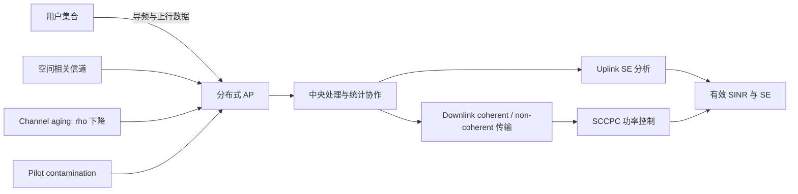
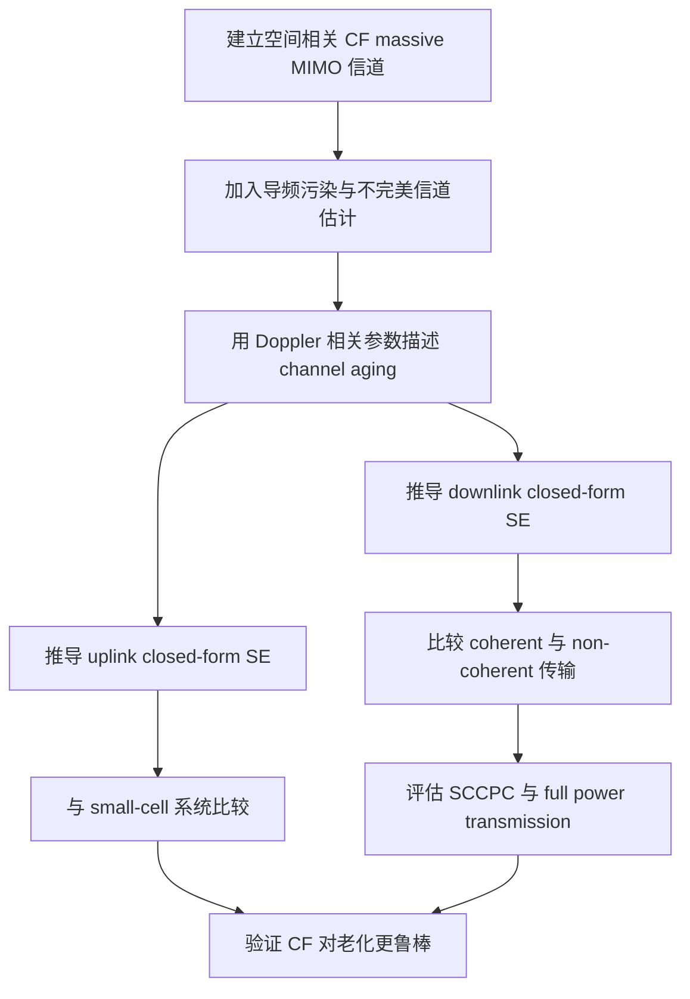

# 从信道老化看 Cell-Free Massive MIMO 的时变信道鲁棒性

## 1. 论文基本信息

* 英文标题：Impact of Channel Aging on Cell-Free Massive MIMO Over Spatially Correlated Channels
* 中文理解标题：空间相关信道下，信道老化对 Cell-Free Massive MIMO 性能的影响
* 作者：Jiakang Zheng, Jiayi Zhang, Emil Bjornson, Bo Ai
* 期刊/会议：IEEE Transactions on Wireless Communications
* 年份：2021
* DOI：10.1109/TWC.2021.3074421
* IEEE Xplore 链接：https://doi.org/10.1109/TWC.2021.3074421
* 阅读日期：2026-06-19
* 关键词：Cell-Free Massive MIMO，channel aging，spatial correlation，pilot contamination，spectral efficiency，Doppler

## 2. 为什么选择这篇论文

这篇论文不直接研究 LEO satellite networks，但它处理的核心问题和 LEO satellite cell-free massive MIMO 很接近：系统在一个时刻估计信道，却要在之后的时刻用这份 CSI 做检测、预编码和功率控制。对于高速 LEO 场景，residual Doppler、轨道运动、用户移动和星间协作时延都会让 CSI 变旧，最终表现为 SINR prediction 误差和链路调度失配。

我选择它主要有三点原因。第一，它把 channel aging 放进 cell-free massive MIMO，而不是只在传统集中式 massive MIMO 中讨论。第二，它同时考虑 spatial correlation、pilot contamination 和 imperfect channel estimation，比只看独立瑞利信道的分析更接近真实系统。第三，它给出了 uplink 和 downlink spectral efficiency 的闭式表达，并用 small-cell 系统、coherent / non-coherent downlink transmission、功率控制等对照来解释系统鲁棒性。

## 3. 论文要解决的问题

Cell-Free Massive MIMO 的基本想法是让大量分布式 AP 协同服务用户，从而弱化小区边界、提升弱覆盖用户的速率。但是这种协作强依赖 CSI。只要信道估计和实际传输之间存在时间间隔，估计到的信道就会和真实信道不一致，这就是 channel aging。

传统分析常常默认 CSI 在一个 coherence block 内可用，或者只把估计误差当成静态噪声处理。作者认为这会低估时变信道的影响：当用户移动、载波频率较高、Doppler 较大，或者系统调度周期较长时，CSI 的时间相关性会下降。对于 cell-free 系统，这个问题还会叠加 pilot contamination 和 AP 之间的协作方式。论文要回答的问题是：在空间相关信道和导频污染存在时，channel aging 会怎样改变 CF massive MIMO 的 uplink / downlink spectral efficiency，以及 CF 架构是否比 small-cell 系统更抗信道老化。

## 4. 系统模型和关键假设

论文考虑一个典型 cell-free massive MIMO 网络：多个分布式 AP 通过中央处理单元协作服务多个用户。每个 AP 可配备多根天线，用户发送导频用于信道估计，随后系统在 uplink 做接收合并，在 downlink 做协同传输。信道不是独立同分布的简单模型，而是包含 spatial correlation；多个用户复用有限导频时还会产生 pilot contamination。

Channel aging 用信道的时间相关性刻画。直观地说，估计时刻的信道 h_hat 和实际传输时刻的信道 h 不再完全一致，中间的相关程度由 Doppler 相关参数决定。Doppler 越大、等待时间越长，旧 CSI 对当前信道的解释力越弱。作者在 uplink 中考虑 large-scale fading decoding 和 matched-filter receiver cooperation，并推导 small-cell 系统作为对比；在 downlink 中比较 coherent transmission 和 non-coherent transmission，并讨论 statistical channel cooperation power control 对干扰的抑制作用。

## 5. 方法概述

论文的核心不是提出一个复杂神经网络，而是建立可分析的性能表达。作者先把估计误差、导频污染、空间相关和时间老化一起放入信道模型，然后推导 uplink 和 downlink 的 closed-form spectral efficiency 表达式。这样做的好处是，系统参数如何影响 SE 不只依赖仿真曲线，而能从公式结构里看出来。

在 uplink，用户发送信号后，各 AP 使用本地接收向量进行处理，再通过协作机制汇聚统计量。论文特别比较 CF 和 SC 两种架构，结论是 CF massive MIMO 在弱用户的 95%-likely uplink SE 上更有优势，也更能缓冲 channel aging 的影响。在 downlink，作者比较 coherent transmission 与 non-coherent transmission：coherent 方式能更好地利用分布式 AP 的相位协作，但也更依赖准确 CSI。SCCPC 用统计信道信息做功率控制，用来缓解 inter-user interference，不过当 channel aging 变强时，功控收益会减弱。

## 6. 关键公式或机制理解

第一个关键机制是 channel aging 的相关模型。可以把实际信道理解成 h_current = rho * h_estimated + aging_error。这里 rho 表示时间相关程度，和 maximum normalized Doppler shift、符号间隔等因素有关。rho 越接近 1，旧 CSI 越可靠；rho 越小，估计信道对当前传输的指导作用越弱。这个机制对 LEO 场景很重要，因为 residual Doppler 和处理时延都会让 rho 在毫秒尺度内变化。

第二个关键指标是 spectral efficiency。论文关心的 SE 可以理解为 SE = prelog_factor * log2(1 + effective SINR)。effective SINR 不只是信号功率除以噪声功率，而是包含估计误差、导频污染、空间相关、AP 协作增益和用户间干扰。对 SINR prediction 来说，这提示我们不能只预测平均路径损耗，还要把 CSI age、Doppler 状态和干扰图结构作为输入。

第三个机制是 SCCPC。它不是每个瞬时信道都重新求一个细粒度功率解，而是利用统计信道协作信息做功率分配，目标是降低用户间干扰并改善弱用户体验。论文发现 SCCPC 优于 full power transmission，但 channel aging 越严重，它的增益越容易被削弱。这说明功率控制和信道预测必须匹配同一个时间尺度。

## 7. 论文方法或系统框架

图 1：论文系统模型框架，展示用户、分布式 AP、中央处理、信道老化、导频污染和上下行 SE 分析之间的关系。

图 2：论文方法流程，展示从信道建模到 SE 推导、系统对比和功率控制评估的主要路径。

## 8. 实验设置与结果理解

论文通过仿真验证闭式表达的准确性，并比较不同系统配置下的 SE 和 energy efficiency。可确认的主要结论包括：CF massive MIMO 的 95%-likely uplink SE 高于 small-cell 系统；在 downlink 中，coherent transmission 的弱用户 SE 明显优于 non-coherent transmission；SCCPC 比 full power transmission 更能抑制用户间干扰，但随着 channel aging 增强，这种优势会被削弱；强 spatial correlation 会降低 SE，但也会改变 channel aging 的影响强度；增加天线数量可以提升 SE，但会降低 energy efficiency。

论文还使用 maximum normalized Doppler shift 来设计 SE-improved length of the resource block。这一点对高速场景很有启发：资源块长度不能只按传统 coherence block 粗略设定，而应该随着 Doppler 和信道老化程度调整。由于这里只基于可确认的题录、摘要和元数据理解，不展开论文表格中的具体数值。

## 9. 对我自己论文的启发

对 LEO 卫星网络建模而言，这篇论文提醒我不要把 CSI 时效性写成一个附属误差项。LEO 卫星移动快，星地链路 Doppler 大，星间协作和中心处理又可能引入额外时延，因此 channel aging 应该成为系统模型里的主变量。当前研究工作如果要强调 millisecond-level downlink SINR prediction，就需要说明预测窗口为什么是毫秒级，以及 residual Doppler 如何改变预测难度。

对 cell-free massive MIMO 的启发是，分布式协作的收益和 CSI aging 是耦合的。CF 架构可以改善弱用户体验，但它需要多个接入点对同一用户保持一致的信道认知。LEO cell-free 场景下，不同卫星到用户的 Doppler、可见窗口和路径损耗变化不完全同步，这会让协作链路的 CSI age 呈现异质性。模型里可以考虑为每条 satellite-user 边加入 age 或 Doppler compensation residual。

对 SINR prediction 的启发是，SINR 不是一个只由距离和发射功率决定的标量。有效 SINR 里包含信道估计误差、导频污染、干扰项、功控策略和协作方式。Interference-aware message passing 可以把用户、卫星、链路和干扰边组织成图，并在消息中显式携带 CSI age、Doppler residual、历史 SINR 和邻接干扰强度。

对 channel aging / residual Doppler 的启发是，rho 类参数可以作为桥梁：它既能连接物理层 Doppler，又能连接学习模型中的时间衰减权重。后续实验可以比较不含 age 特征、只含 Doppler 特征、同时含 Doppler 与 age 特征的模型，在 CP、MAE 和 latency 上的差异。

对 IEEE TVT 审稿意见回复的启发是，若审稿人质疑预测模型的物理可解释性，可以借鉴这篇论文的表达方式：先把 channel aging 的物理来源讲清楚，再说明学习模型不是替代通信模型，而是在老化 CSI 与复杂干扰共同作用下近似 effective SINR 映射。这样比单纯强调神经网络精度更稳。

## 10. 这篇论文的优点

1. 把 channel aging、spatial correlation、pilot contamination 和 imperfect CSI 放在同一个 CF massive MIMO 分析框架中。
2. 同时覆盖 uplink 和 downlink，不只讨论单一链路方向。
3. 用 closed-form SE 表达式支撑结论，便于理解参数变化的影响。
4. 通过 small-cell、coherent / non-coherent transmission、SCCPC 等对照解释 CF 架构的优势和限制。
5. 把 maximum normalized Doppler shift 与资源块长度设计联系起来，对高速移动场景有参考价值。

## 11. 这篇论文的局限

1. 场景主要是地面 CF massive MIMO，并未直接建模 LEO 卫星轨道、星间链路和可见性变化。
2. 分析依赖统计信道模型，对复杂非平稳场景的瞬时干扰变化覆盖有限。
3. SCCPC 仍然偏向统计功控，面对毫秒级快速变化时可能需要更轻量的在线更新。
4. 论文重点是 SE 和 energy efficiency，对预测误差、推理时延、覆盖概率等学习系统指标讨论较少。
5. 对大规模动态图网络中的分布式实现复杂度没有展开。

## 12. 我可以借鉴的写作句式或结构

这篇论文的引入方式值得借鉴：先说明 CF massive MIMO 的协作收益，再指出 CSI 在移动场景中会老化，最后把 channel aging 变成核心研究问题。Related work 的组织也比较清晰，可以按 “CF massive MIMO 基础分析 - channel aging - spatial correlation / pilot contamination - 功率控制” 逐层推进。

贡献写法上，论文没有泛泛说“提出新框架”，而是明确写出推导 uplink / downlink SE、比较 CF 与 SC、评估 downlink 传输方式和功控策略。实验叙述上，它先验证公式，再比较方案，最后讨论参数影响。这种结构适合当前研究工作：先证明预测任务的物理动机，再展示模型、基线和指标，而不是直接堆模型模块。

## 13. 后续可以继续追的问题

1. 在 LEO CF-mMIMO 中，如何为每条 satellite-user link 定义可学习的 CSI age 特征？
2. Residual Doppler、channel aging 和 pilot contamination 是否可以统一进入 SINR prediction 的图消息？
3. 资源块长度是否应随预测误差和 Doppler 状态自适应调整？
4. CF 架构在高速移动场景下的弱用户 CP 提升，是否会被协作时延抵消？
5. 在满足毫秒级 latency 的条件下，IA-MPNN 能否接近统计功控或优化算法的 SINR / CP 表现？

## 14. 一句话总结

这篇论文的价值在于，它把 cell-free massive MIMO 的协作收益放到 channel aging 和 Doppler 相关的时变信道中检验，为 LEO CF-mMIMO 的毫秒级 SINR prediction 提供了清晰的物理建模入口。

## 15. 引用信息

J. Zheng, J. Zhang, E. Bjornson, and B. Ai, "Impact of Channel Aging on Cell-Free Massive MIMO Over Spatially Correlated Channels," IEEE Transactions on Wireless Communications, vol. 20, no. 10, pp. 6451-6466, Oct. 2021, doi: 10.1109/TWC.2021.3074421.
