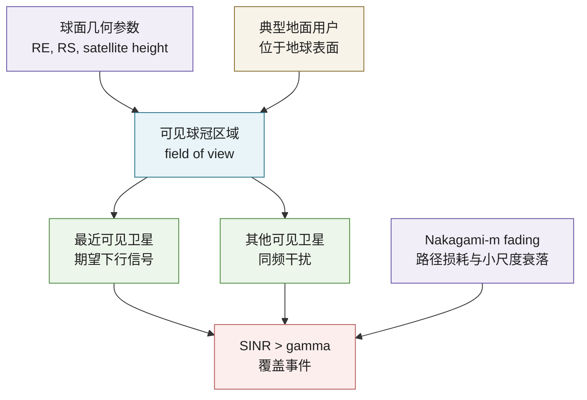
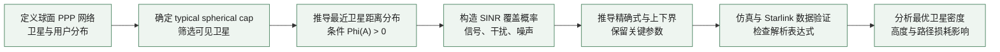

# 从随机几何看下行卫星网络覆盖概率分析

## 1. 论文基本信息

* 英文标题：A Tractable Approach to Coverage Analysis in Downlink Satellite Networks
* 中文理解标题：面向下行卫星网络覆盖概率分析的可处理随机几何方法
* 作者：Jeonghun Park, Jinseok Choi, Namyoon Lee
* 期刊/会议：IEEE Transactions on Wireless Communications
* 年份：2023
* DOI：10.1109/TWC.2022.3198103
* IEEE Xplore 链接：https://doi.org/10.1109/TWC.2022.3198103
* 阅读日期：2026-06-22
* 关键词：satellite networks, stochastic geometry, coverage probability, SINR, LEO, Nakagami fading

## 2. 为什么选择这篇论文

这篇论文值得读，是因为它把 LEO/VLEO 卫星网络的覆盖性能分析从复杂星座仿真推进到可解析模型。当前研究方向关注 LEO satellite cell-free massive MIMO 下的 millisecond-level SINR prediction，而预测模型最终不能只看 MAE，还要说明预测误差如何影响 coverage probability、链路可用性和用户服务质量。

这篇论文不直接研究 cell-free massive MIMO，也不提出 GNN 或 MPNN；它的价值在于提供了一个清晰的系统级参照：如何把卫星高度、卫星密度、路径损耗、Nakagami fading 和 SINR threshold 组织成覆盖概率表达式。对当前研究工作来说，这类覆盖概率模型可以作为 IA-MPNN 预测结果的上层评价指标，也可以帮助解释为什么某些轨道高度、卫星密度或干扰强度下 SINR prediction 更敏感。

## 3. 论文要解决的问题

传统卫星网络常用 Walker constellation 或多轨道几何网格建模。这类模型适合工程仿真，但如果每次都依赖系统级 Monte Carlo 仿真，研究者很难快速回答“卫星高度变高会怎样”“卫星密度增大是否一定改善覆盖”“干扰受限和噪声受限分别由哪些参数主导”这类设计问题。

作者要解决的核心问题是：能否用随机几何为下行卫星网络建立一个既贴合球面几何、又能推导覆盖概率的模型。论文把卫星和用户分别建模在同心球面上，并把典型用户可见的卫星集合限制在球冠区域内。这样既保留了卫星网络的有限空间边界，又避免完全依赖固定星座仿真。

传统地面蜂窝网络中的 PPP 随机几何模型通常假设无限二维平面，典型用户分析较自然；但卫星网络是球面有限空间，用户可见卫星由地球遮挡和视场决定，最近卫星距离分布、干扰集合和边界效应都会变化。论文的贡献就在于重新推导这些关键统计量，再得到覆盖概率表达式。

## 4. 系统模型和关键假设

论文考虑下行卫星网络。卫星位于半径为 RS 的球面上，地面用户位于半径为 RE 的地球表面上，其中 RS 大于 RE。卫星位置服从球面上的 homogeneous spherical Poisson point process，用户位置也服从独立的球面 PPP。作者利用 Slivnyak's theorem，把分析集中到位于地球表面某一点的 typical receiver。

典型用户只能看到地平线以上的卫星，因此可服务卫星集合是卫星球面上的一个 spherical cap。用户默认连接距离最近的可见卫星，其他可见卫星产生同频干扰。无线传播模型包括路径损耗和 Nakagami-m small-scale fading，用 m 表示 LoS 程度。覆盖事件定义为典型用户的 SINR 高于门限 gamma。

关键假设包括：卫星使用相同发射功率；卫星位置在统计意义上均匀；小尺度 fading 可由 Nakagami-m 描述；分析重点放在覆盖概率而不是调度、波束成形或多用户资源分配。论文也分别讨论 interference-limited 与 noise-limited 情形，并给出便于理解的上下界或近似形式。

## 5. 方法概述

论文的核心思想是先处理卫星网络球面有限空间带来的几何难点，再把该几何结果嵌入 SINR 覆盖概率推导。第一步，作者定义 typical spherical cap，也就是典型用户视场内的可见卫星区域。第二步，作者在至少存在一颗可见卫星的条件下，推导从典型用户到最近卫星的距离分布。这个距离分布是后续信号功率和干扰功率分析的入口。

第三步，作者在 Nakagami-m fading 下推导覆盖概率表达式。覆盖概率本质上是 `P[SINR > gamma]`，其中 desired signal 来自最近卫星，interference 来自其他可见卫星。第四步，作者进一步推导上下界和更紧凑的下界表达式，用来解释卫星密度、卫星高度和路径损耗指数对覆盖概率的影响。

和只给仿真曲线的系统研究不同，这篇论文更强调“参数如何进入公式”。它没有使用深度学习，也没有引入 beamforming 或 MPNN；但它给后续学习型 SINR prediction 提供了很好的解析基线：预测模型可以学习复杂动态，而覆盖概率表达式可以帮助检查预测结果是否符合空间几何规律。

## 6. 关键公式或机制理解

第一个关键机制是 spherical cap 内最近卫星距离分布。地面用户并不是在无限平面上找最近基站，而是在可见球冠内找最近卫星。作者在条件 `Phi(A) > 0` 下推导距离分布，使得后续分析不被“没有可见卫星”的情况混在一起。这个处理对 LEO 网络很重要，因为覆盖中断不仅来自 fading 或干扰，也可能来自几何可见性。

第二个关键机制是覆盖概率分解。论文可以理解为先计算“有可见卫星时 SINR 超过门限的概率”，再乘上“至少有一颗卫星落在可见球冠内的概率”。也就是说，覆盖概率同时受两类因素影响：一类是几何可见性，另一类是链路 SINR。这个分解对当前研究很有启发，因为 IA-MPNN 如果只预测已连接链路的 SINR，可能还需要额外模块处理可见性和服务集合变化。

第三个关键机制是最优卫星密度。论文指出，在卫星下行网络中，增加卫星密度并不总是单调改善覆盖概率。密度增加会提高可见卫星存在概率并缩短服务距离，但也会增加同频干扰。作者进一步分析了卫星高度和路径损耗指数下的最优平均卫星数量。这个结论对 LEO CF-mMIMO 也很关键：协作节点变多不等于性能必然变好，干扰和协调代价必须一起看。

## 7. 论文方法或系统框架

图 1：下行卫星网络覆盖分析框架，展示典型用户、可见球冠、最近服务卫星、干扰卫星以及 SINR 覆盖事件之间的关系。

图 2：论文方法流程，展示从球面随机几何建模到覆盖概率推导、仿真验证和网络设计结论的主要路径。

## 8. 实验设置与结果理解

论文通过数值仿真验证解析表达式。仿真重点不是提出新的学习算法，而是检查推导出的覆盖概率是否与 Monte Carlo 结果一致。作者考察了 Nakagami fading 参数 m、路径损耗指数 alpha、卫星高度、卫星密度和 SINR threshold 等因素。论文还使用实际 Starlink 星座数据集进行对照，以说明随机几何模型虽然抽象，但可以捕捉真实星座覆盖分析中的主要趋势。

从结果理解看，第一，解析表达式和仿真曲线能够很好匹配，说明球面 PPP 与条件最近距离分布的推导是有效的。第二，在较密集卫星部署下，网络可能更接近 interference-limited，此时噪声影响相对弱；这对 LEO 下行系统的 SINR prediction 很重要，因为模型应关注干扰结构，而不是只拟合单链路路径损耗。第三，覆盖概率对卫星密度不是简单单调关系，存在几何可见性和干扰增强之间的权衡。

论文没有报告面向 GNN、MPNN 或 cell-free beamforming 的实验，因为这不是它的研究对象。因此，不能把它的覆盖概率结论直接等同于 LEO CF-mMIMO 协作传输收益。更稳妥的理解是：它为“单连接或最近卫星服务下的下行覆盖分析”提供了解析参照，后续可以在此基础上思考多卫星协作、动态服务集合和预测式干扰管理。

## 9. 对我自己论文的启发

对 LEO 卫星网络建模的启发是，系统模型不能只画“卫星在天上、用户在地面”。这篇论文明确把地球半径、卫星轨道半径、可见球冠和服务卫星集合写进模型。当前研究工作如果强调 LEO satellite cell-free massive MIMO，也应说明服务卫星集合如何由可见性、距离、波束覆盖或协作策略决定，否则 SINR prediction 的输入图结构会显得缺少物理边界。

对 cell-free massive MIMO 的启发是，协作集合大小与性能之间不应默认单调正相关。论文中的卫星密度权衡提醒我：更多可见卫星一方面可能带来更短服务距离或更多协作机会，另一方面也带来更强干扰、更复杂同步和更高协作开销。IA-MPNN 的优势可以放在这里：它不是简单把所有邻近卫星都当作有益节点，而是通过 interference-aware message passing 区分服务边、强干扰边和弱相关边。

对 SINR prediction 的启发是，预测目标可以从单点误差扩展到系统覆盖事件。除了报告 SINR MAE，还可以报告 `P[predicted SINR > threshold]` 与真实覆盖事件的一致性，或者在不同 gamma 下评估 coverage probability 误差。这样能把毫秒级预测与通信系统指标连接起来，避免审稿人认为预测误差只是机器学习指标。

对 channel aging 和 residual Doppler 的启发是，这篇论文主要是静态空间统计模型，没有显式描述高速运动造成的 CSI aging 或 residual Doppler。当前研究工作正好可以补这个空白：在给定球面几何和可见卫星集合的基础上，引入毫秒级时间演化，让 SINR 不只是由距离和 fading 决定，还受到过期 CSI、残余频偏和干扰拓扑变化影响。

对 interference-aware message passing 的启发是，图结构可以借鉴论文的几何分层。节点可以分为用户、服务卫星和可见干扰卫星；边特征可以包含距离、仰角、可见性、相对速度、历史 SINR 和预测时延；消息聚合时可以显式区分 desired signal contribution 与 interference contribution。这样 IA-MPNN 的设计会更像通信模型，而不是普通图回归。

对 CP、MAE、latency 等实验指标的启发是，coverage probability 可以成为 MAE 的系统级补充。当前研究可以设置多个 SINR threshold，比较不同模型在 CP 估计上的偏差；也可以把 latency 放进分析：如果推理延迟超过信道变化时间尺度，即使 MAE 离线较低，在线覆盖决策也可能失效。

对 IEEE TVT 审稿意见回复的启发是，可以用“几何可见性 -> 干扰结构 -> SINR 分布 -> 覆盖概率”这条链解释实验设计。若审稿人质疑为什么选择某些用户密度、卫星高度或干扰场景，可以回应这些参数会直接改变覆盖概率和 SINR 分布，因此是验证模型鲁棒性的必要维度。

对后续实验或论文表述的启发是，可以增加一组覆盖概率相关实验：用真实 SINR 和预测 SINR 分别计算 CP 曲线，比较 proposed IA-MPNN 与 baseline 在不同 threshold 下的差距。如果 proposed 方法不仅降低 MAE，还能更准确保持 CP 曲线，就能更有力地说明其通信价值。

## 10. 这篇论文的优点

1. 把卫星网络有限球面空间中的覆盖分析写得清楚，避免直接套用无限平面蜂窝模型。
2. 最近可见卫星距离分布的处理很关键，使后续覆盖概率推导更可处理。
3. 同时讨论精确表达式、上下界和可解释近似，兼顾数学完整性和网络设计直觉。
4. 参数解释清楚，能看出卫星高度、密度、路径损耗和 fading 参数如何影响覆盖概率。
5. 使用仿真和真实星座数据进行验证，增强了模型可信度。

## 11. 这篇论文的局限

1. 模型重点是覆盖概率解析，没有讨论多卫星协作、cell-free massive MIMO 或 beamforming。
2. 卫星位置采用统计模型，不能完全表达具体星座轨道、业务负载和调度策略。
3. 对 LEO 高速运动带来的 channel aging、Doppler dynamics 和时变拓扑没有深入建模。
4. 用户关联主要围绕最近可见卫星，和实际系统中的多连接、负载均衡或波束切换仍有距离。
5. 实验指标集中在覆盖概率，对端到端吞吐、时延、预测误差和计算复杂度的联合评价不足。

## 12. 我可以借鉴的写作句式或结构

问题引入方式可以借鉴它的层次：先说明 universal coverage 和 LEO/VLEO 星座的重要性，再指出固定轨道几何仿真难以给出解析洞察，最后自然引出 stochastic geometry。这个结构适合当前论文从 LEO 网络复杂性引出毫秒级 SINR prediction。

related work 组织方式也值得学习。论文先讲传统确定性星座模型，再讲已有随机几何卫星网络工作，最后指出有限空间 PPP、最近距离分布和覆盖概率表达式仍不够可处理。当前研究可以类似地先分组综述 LEO dynamics、CF-mMIMO、SINR prediction 和 GNN/MPNN，再明确自己的缺口。

contribution 写法可以学习其“模型、推导、验证、设计洞察”四段式。对 IA-MPNN 工作来说，可以对应写成：构建 LEO CF-mMIMO 时空干扰图；提出干扰感知消息传递预测框架；通过 MAE、CP 和 latency 验证；给出残余 Doppler 和 channel aging 下的设计启发。

experiment 叙述方式上，论文不是只说解析式匹配仿真，而是把曲线变化和参数含义联系起来。当前研究在展示模型性能时，也应解释为什么某个场景更难预测，为什么干扰密度或卫星高度变化会改变误差分布。

limitation 表述可以保持客观：明确哪些因素被模型抽象掉，再说明这些因素是未来扩展方向，而不是简单否定已有模型。

## 13. 后续可以继续追的问题

1. 如何把球面随机几何覆盖概率与 LEO CF-mMIMO 的多卫星协作服务集合结合起来？
2. 在 channel aging 和 residual Doppler 存在时，覆盖概率表达式会如何偏离静态统计模型？
3. IA-MPNN 预测出的 SINR 能否用于实时估计 CP 曲线，并辅助服务卫星选择？
4. 最优卫星密度结论在多连接、beamforming 和功率控制场景下是否仍然成立？
5. 如何把真实星座轨道数据、业务负载和用户移动性放进可复现的 SINR prediction benchmark？

## 14. 一句话总结

这篇论文用球面随机几何把下行卫星网络的可见性、干扰、SINR 和覆盖概率串成可解释框架，为当前 LEO CF-mMIMO SINR prediction 工作提供了系统级评价和参数设计参照。

## 15. 引用信息

IEEE 风格引用：

J. Park, J. Choi, and N. Lee, "A Tractable Approach to Coverage Analysis in Downlink Satellite Networks," IEEE Transactions on Wireless Communications, vol. 22, no. 2, pp. 793-807, Feb. 2023, doi: 10.1109/TWC.2022.3198103.
