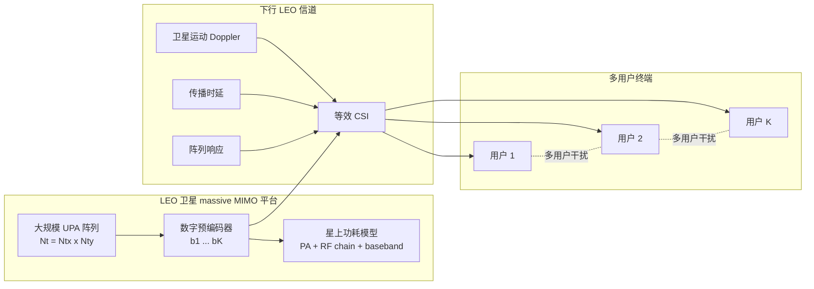
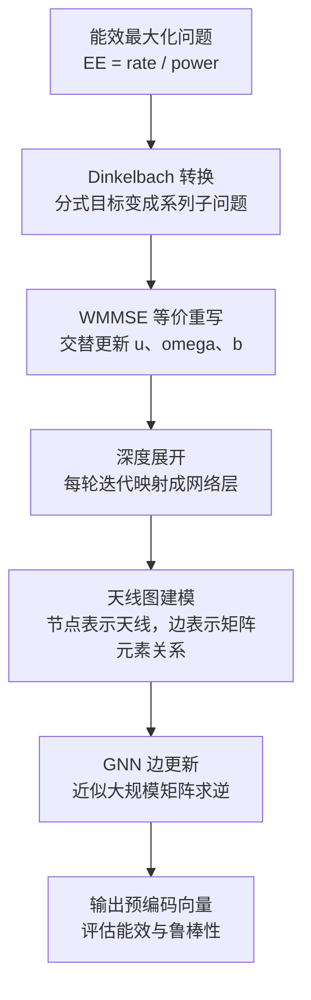

# 从 GNN 深度展开看 LEO Massive MIMO 预编码的能效优化

## 1. 论文基本信息

* 英文标题：GNN-Enabled Deep Unfolding for Precoding in Massive MIMO LEO Satellite Communications
* 中文理解标题：面向 LEO massive MIMO 预编码的 GNN 深度展开方法
* 作者：Huibin Zhou, Xinrui Gong, Christos G. Tsinos, Li You, Xiqi Gao, Bjorn Ottersten
* 期刊/会议：2025 IEEE Wireless Communications and Networking Conference (WCNC)
* 年份：2025
* DOI：10.1109/WCNC61545.2025.10978590
* IEEE Xplore 链接：https://doi.org/10.1109/WCNC61545.2025.10978590
* 阅读日期：2026-06-23
* 关键词：LEO satellite communications, massive MIMO, precoding, GNN, deep unfolding, WMMSE, Dinkelbach, energy efficiency

## 2. 为什么选择这篇论文

这篇论文值得读，主要因为它把 LEO 卫星 massive MIMO 的下行预编码问题，与 GNN 和 algorithm unfolding 结合在一起。当前研究工作关注 LEO satellite cell-free massive MIMO 中的毫秒级 SINR prediction 和 interference-aware message passing，这篇论文虽然不是 cell-free 架构，也不是直接预测 SINR，但它把天线阵列、用户干扰、SINR 上界、能效目标和图神经网络推理放在同一个预编码框架里，对理解“图结构如何承载无线优化问题”很有帮助。

另一个原因是，论文目标不是单纯提升速率，而是优化 energy efficiency。LEO 卫星受载荷、供电和实时处理能力约束，很多算法即使理论性能好，也可能难以在星上实时执行。作者用深度展开把 Dinkelbach 和 WMMSE 的迭代过程变成可训练网络，并用 GNN 近似矩阵求逆，这一点和低时延 SINR 推理、毫秒级更新、低复杂度消息传递有直接关联。

## 3. 论文要解决的问题

LEO 卫星通信中引入 massive MIMO，可以通过大规模阵列提升链路预算、覆盖能力和多用户服务能力。但预编码设计会遇到三个问题。

第一，LEO 卫星平台的功率和计算资源有限。传统迭代优化算法通常需要多轮矩阵运算，特别是矩阵求逆，在大规模阵列下复杂度较高。

第二，LEO 场景具有明显的动态性。信道中包含由卫星运动导致的 Doppler shift、传播时延和阵列响应，预编码如果不能快速更新，性能会被时变信道削弱。

第三，能效最大化本身是非凸分式优化问题。论文把系统目标写成“总吞吐量除以总功耗”的形式，既要保证速率，又要控制发射功率和硬件功耗，因此不能只用简单的最大速率思路处理。

作者的核心目标是：在 massive MIMO LEO 下行系统中，用更低复杂度、更好可解释性的深度展开网络，逼近传统优化算法的能效表现。

## 4. 系统模型和关键假设

论文考虑单颗 LEO 卫星向多个单天线用户终端进行下行传输。卫星搭载大规模 uniform planar array，阵列规模写作 Ntx x Nty，总天线数为 Nt。每个用户对应一个下行信道向量，信道表达式中包含路径增益、Doppler shift、传播时延和阵列响应。

作者对信道做了一个重要简化：同一用户的不同路径共享卫星侧 Doppler shift 和阵列响应，用户侧多径差异主要体现在等效的小尺度部分和时延项中。这个处理使得 LEO 运动带来的相位旋转和阵列方向信息能够被单独抽象出来，便于后续预编码设计。

下行接收信号由期望信号、其他用户预编码信号造成的干扰和噪声组成。用户 k 的 SINR 由其预编码向量、信道向量、其他用户预编码向量和噪声功率共同决定。系统功耗包括发射功率放大器相关功耗以及卫星发射机硬件功耗，后者覆盖 DAC、mixer、filter、baseband amplifier 等模块。

优化目标是最大化系统能效，即 EE = total achievable rate / total power consumption，并受到总发射功率约束。

## 5. 方法概述

论文方法可以理解为三层组合。

第一层是 Dinkelbach algorithm。能效最大化是分式问题，作者用 Dinkelbach 思路把原问题转换成一系列带辅助变量 rho 的子问题。每一轮固定 rho 后，目标变成“加权总速率减去 rho 乘以总功耗”。

第二层是 WMMSE reformulation。子问题仍然不好直接求解，因此作者引入接收变量和权重变量，把速率相关目标转成 WMMSE 形式。这样可以交替更新 u、omega 和 b，其中 b 是预编码向量。

第三层是 GNN-enabled deep unfolding。传统 WMMSE 更新里最重的步骤是矩阵求逆。作者把迭代更新展开成网络层，把天线看成图节点，把天线之间的矩阵元素关系看成边，再用 GNN 的边更新去近似矩阵逆。为了让这种近似更有结构依据，论文把一阶 Taylor expansion 的矩阵逆近似与 GNN 边更新形式联系起来。

这类方法的优点是，不是把预编码当成黑盒回归，而是把传统优化算法的迭代结构保留下来，再让可训练参数学习其中难以快速计算的部分。

## 6. 关键公式或机制理解

第一个关键机制是能效目标：EE = Bw * sum(R_k) / P_total。这里 Bw 是带宽，R_k 是用户 k 的可达速率，P_total 是总功耗。它说明论文不是只追求 SINR 或 sum rate，而是在速率提升和功耗控制之间做权衡。对 LEO 卫星来说，这比单纯速率最大化更贴近星上载荷约束。

第二个关键机制是 SINR 结构。用户 k 的 SINR 可以理解为：有用信号功率 / 其他用户干扰功率加噪声功率。有用信号由用户 k 的信道和预编码向量决定，干扰项来自其他用户的预编码向量。这一结构与 interference-aware message passing 很接近，因为每个用户的性能都由“自身链路”和“邻近干扰链路”共同决定。

第三个关键机制是矩阵逆近似。WMMSE 更新预编码时需要处理大尺寸矩阵逆，复杂度随天线数增长明显。论文使用 Taylor expansion 的形式近似 P^-1，再把这种迭代近似嵌入 GNN 边更新。直观上，GNN 不是随意学习一个矩阵逆，而是在学习“矩阵元素之间如何通过局部邻接关系逐层传播并逼近逆矩阵”。

## 7. 论文方法或系统框架

图 1：论文系统模型框架，展示 LEO 卫星大规模阵列、下行信道、预编码器、功耗模型和多用户干扰之间的关系。

图 2：论文方法流程，展示从能效优化建模到 Dinkelbach-WMMSE 深度展开，再到 GNN 近似矩阵求逆的主要路径。

## 8. 实验设置与结果理解

论文仿真评估的是 LEO 卫星下行 massive MIMO 系统中的能效表现。典型参数包括 20 MHz 带宽、8 x 8 天线阵列、10 个用户、2 GHz 载频、0 dB 信噪比和总发射功率约束。作者比较了传统优化算法、linear deep unfolding 和 GNN deep unfolding。

实验主要看两个维度。第一是天线数变化时的 energy efficiency。随着天线数量增加，系统能效提升，因为阵列增益和空间分离能力增强。GNN deep unfolding 的能效接近传统迭代优化算法，并优于较简单的线性深度展开方法。

第二是用户数变化时的泛化能力。论文展示了在相同天线数量下，训练后的模型面对不同用户数时仍能保持接近专门训练模型的性能。这说明方法不只是拟合固定规模场景，而具有一定结构泛化能力。

需要注意的是，论文实验重点是 energy efficiency 和复杂度相关表现，并没有直接报告面向 cell-free 架构的覆盖概率、handover 或端到端推理时延指标。因此，对当前研究工作的启发应主要放在图结构建模、干扰耦合表达和低复杂度推理上，而不是直接迁移其系统结论。

## 9. 对我自己论文的启发

对 LEO 卫星网络建模的启发在于，论文没有把 Doppler 只当成背景噪声，而是写进信道响应。当前研究工作如果强调 channel aging 和 residual Doppler，就应该在系统模型中清楚交代 Doppler 如何影响 CSI、SINR 和预测目标，而不是只在实验部分提一句高速移动。

对 cell-free massive MIMO 的启发在于，虽然本文是单星 massive MIMO，不是多卫星 cell-free，但它把阵列元素之间的关系建成图。对于 LEO satellite cell-free massive MIMO，可以进一步把图节点从“天线”扩展为“卫星接入点、用户、波束或链路”，边特征则表达大尺度衰落、残余 Doppler、干扰耦合和可见性关系。

对 SINR prediction 的启发是，SINR 不是孤立用户标签，而是由预编码、信道、干扰用户集合和噪声共同决定。当前研究中的 IA-MPNN 可以把每条干扰边的贡献显式建模，使模型学习“哪些邻居真正影响当前用户 SINR”，而不是只输入一个全局 CSI 张量。

对 channel aging / residual Doppler 的启发是，论文信道表达式中 Doppler 和 delay 共同控制相位变化。若要做毫秒级 SINR prediction，可以把前一时刻 CSI、当前几何状态和残余 Doppler 作为消息传递输入，使模型学习短时动态误差对 SINR 的影响。

对 interference-aware message passing 的启发是，GNN 边更新可以和传统矩阵运算建立对应关系。当前研究在写方法贡献时，可以强调消息传递不是任意堆叠 GNN，而是服务于干扰图上的局部聚合、邻居影响加权和低复杂度推理。

对实验指标的启发是，除了 MAE 和 coverage probability，也可以报告 latency 或复杂度随用户数、卫星数变化的曲线。本文的实验思路提醒我们：如果主张毫秒级预测，就需要展示推理时间如何随网络规模变化，而不是只给平均误差。

对 IEEE TVT 审稿意见回复的启发是，如果审稿人质疑“为什么用 GNN”，可以借鉴本文的论证方式：先从经典优化或物理模型中指出高复杂度环节，再说明图结构对应无线系统中的节点、边和耦合关系，最后用实验展示性能与复杂度折中。

对后续论文表述的启发是，contribution 不应只写“提出一个 GNN 模型”，而应写清楚“该模型继承了无线系统结构、干扰关系和低复杂度推理需求”。这样更容易让无线通信审稿人接受 AI 模块的必要性。

## 10. 这篇论文的优点

* 把能效最大化、WMMSE、Dinkelbach 和 GNN 深度展开放在同一框架中，方法链条比较清楚。
* 没有完全依赖黑盒神经网络，而是保留了经典优化迭代的可解释结构。
* 针对 massive MIMO 中矩阵求逆复杂度高的问题给出具体处理思路。
* 实验比较了传统优化、线性深度展开和 GNN 深度展开，能看出 GNN 结构的贡献。
* 论文主题贴近 LEO 卫星星上计算受限、实时预编码和能效优化的实际需求。

## 11. 这篇论文的局限

* 系统模型是单颗 LEO 卫星下行 massive MIMO，没有覆盖多卫星 cell-free 协作。
* 实验规模相对有限，尚不能直接说明超大规模星座或密集用户场景下的端到端表现。
* 论文主要优化能效，没有深入讨论 handover、覆盖概率或星间协作约束。
* 对 residual Doppler、CSI aging 和预测误差的鲁棒性分析还不够充分。
* 实验没有把真实星历、真实业务负载或实际星上硬件时延纳入完整闭环。

## 12. 我可以借鉴的写作句式或结构

问题引入可以采用“LEO 通信需求增长 -> massive MIMO 提升性能 -> 星上资源受限导致传统优化难以实时运行”的顺序，这样比直接介绍模型更自然。

related work 可以按技术路线组织：传统优化方法、深度学习方法、algorithm unfolding 方法、GNN 方法。这样的层次能突出本文为什么不是简单套用神经网络。

contribution 写法可以强调“把经典算法展开成可训练结构”“用图结构降低关键矩阵运算复杂度”“在能效和复杂度之间取得折中”。

experiment 叙述可以先给固定参数设置，再分别讨论天线数、用户数等变量对指标的影响。这样对读者判断方法可扩展性更直接。

limitation 表述可以保持客观：说明当前模型覆盖的系统边界，再指出后续可以加入更动态的 LEO 星座、多卫星协作和真实时延约束。

## 13. 后续可以继续追的问题

* GNN 深度展开能否扩展到多卫星 cell-free massive MIMO 的联合预编码或 SINR prediction？
* residual Doppler 和 channel aging 能否作为边特征进入 interference-aware message passing？
* 在卫星数、用户数快速变化时，图模型如何保持低时延推理和稳定泛化？
* 能效、覆盖概率、SINR MAE 和推理 latency 是否可以放在同一实验框架中评估？
* 如果加入不完美 CSI 和过期 CSI，GNN 近似优化算法的鲁棒性会怎样变化？

## 14. 一句话总结

这篇论文的价值在于，它展示了如何把 LEO massive MIMO 预编码中的经典优化结构转化为可解释、低复杂度的 GNN 深度展开推理框架，为当前研究中的干扰感知消息传递和毫秒级 SINR 预测提供了方法论参考。

## 15. 引用信息

H. Zhou, X. Gong, C. G. Tsinos, L. You, X. Gao, and B. Ottersten, "GNN-Enabled Deep Unfolding for Precoding in Massive MIMO LEO Satellite Communications," 2025 IEEE Wireless Communications and Networking Conference (WCNC), 2025, doi: 10.1109/WCNC61545.2025.10978590.
