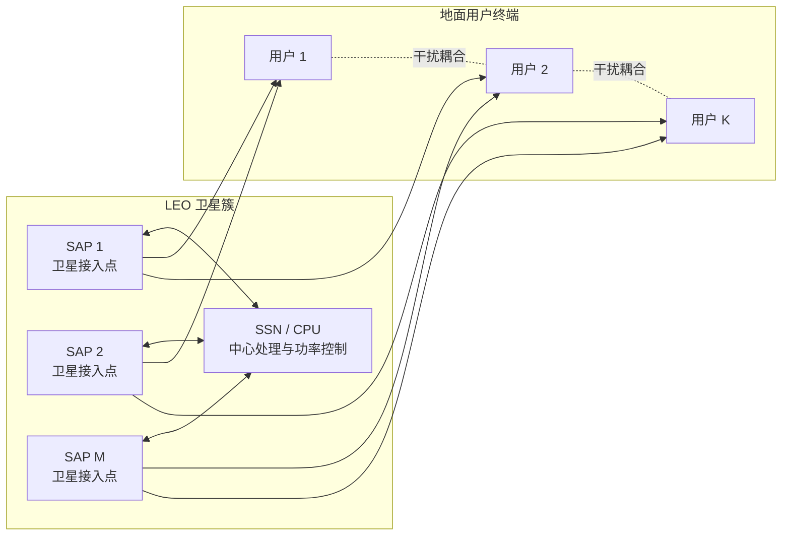
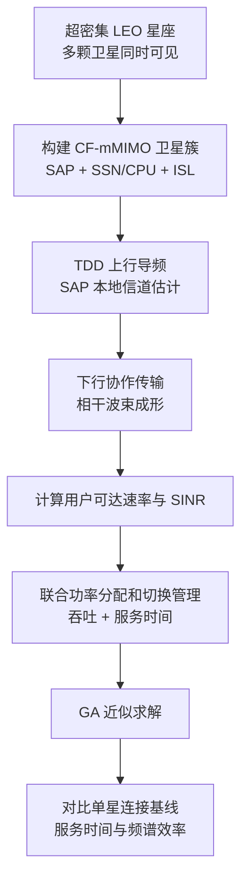

# 从超密集 LEO 星座看 Cell-Free Massive MIMO 架构设计

## 1. 论文基本信息

* 英文标题：Future Ultra-Dense LEO Satellite Networks: A Cell-Free Massive MIMO Approach
* 中文理解标题：面向未来超密集 LEO 卫星网络的 Cell-Free Massive MIMO 架构
* 作者：Mohammed Y. Abdelsadek, Halim Yanikomeroglu, Gunes Karabulut Kurt
* 期刊/会议：2021 IEEE International Conference on Communications Workshops (ICC Workshops)
* 年份：2021
* DOI：10.1109/ICCWorkshops50388.2021.9473753
* IEEE Xplore 链接：https://ieeexplore.ieee.org/document/9473753
* 阅读日期：2026-06-24
* 关键词：LEO satellite networks, cell-free massive MIMO, satellite access point, inter-satellite link, handover management, power allocation, Rician channel

## 2. 为什么选择这篇论文

这篇论文值得读，是因为它较早把 cell-free massive MIMO 明确引入到超密集 LEO satellite networks 中。前几天读的论文已经覆盖了 LEO CF-mMIMO 的覆盖概率、加权和速率、RSMA、联邦学习波束成形和 GNN 预编码，而这篇 2021 年 IEEE ICC Workshops 论文更像架构源头：它先回答“LEO 星座为什么可以被组织成 cell-free 协作阵列”，再讨论 TDD、导频、波束成形、切换管理和功率分配。

当前研究工作关注 LEO satellite cell-free massive MIMO 中的毫秒级 downlink SINR prediction。要把 SINR prediction 写得可信，不能只讨论神经网络模型，还需要说明底层系统为什么会形成多卫星协作、时变可见性、干扰耦合和切换压力。这篇论文正好提供了一个清晰的系统背景：多个 satellite access points 通过 inter-satellite links 接入中心处理单元，用户不再只依赖单颗卫星，而是由一个卫星簇协作服务。

## 3. 论文要解决的问题

传统 LEO 卫星网络通常采用单星连接或有限多连接。由于卫星高速运动，用户与某颗卫星之间的可见时间有限，链路质量会随几何关系变化，频繁切换会带来信令开销、处理时延、吞吐损失和数据转发压力。随着 LEO mega-constellation 变得更密集，同一用户同时可见多颗卫星将成为常态，单星连接没有充分利用这种空间冗余。

作者提出的问题是：能否把地面 cell-free massive MIMO 的思想迁移到 LEO SatNets，让多个 LEO 卫星作为分布式 satellite access points 协作服务地面用户，并通过联合功率分配和切换管理提升吞吐、延长服务时间、降低切换频率？

这不是单纯的架构概念。论文还进一步讨论了信道估计、下行传输、可达速率和优化问题。作者希望在满足用户最低速率需求的前提下，同时最大化网络吞吐和服务用户数量，从而把“协作覆盖”落到可计算的资源分配问题上。

## 4. 系统模型和关键假设

论文考虑一个由 M 个 satellite access points 组成的 LEO 卫星簇，服务 K 个单天线地面用户终端。每颗卫星或每个卫星天线单元可以被视为 SAP，簇内 SAP 通过 inter-satellite links 与中心处理单元相连。中心处理单元可以部署在具备更强计算能力的 super satellite node 上，负责协调数据和功率控制参数。

系统采用 TDD 操作，利用上下行信道互易性。一个相干块被划分为上行导频、上行数据和下行数据三部分。用户发送上行导频，SAP 本地估计上行信道，并把估计结果用于下行预编码。由于用户数量可能大于正交导频数量，导频复用会导致 pilot contamination，这会影响后续速率表达和功率分配。

信道方面，论文采用 Rician 模型描述用户到 SAP 的链路，包含强 LoS 分量、NLoS 分量、距离损耗、阴影衰落、波束指向角损耗和相位变化。相位项用于刻画卫星和用户运动、传播时延等造成的变化。这个假设对 LEO 场景很关键，因为高速运动会让信道相干时间、CSI 有效性和下行 SINR 都变得敏感。

切换方面，传统单星连接的服务时间受单颗卫星可见时间限制，而 CF-mMIMO 架构下用户连接的是一个卫星簇。只要簇内 SAP 还能通过协作满足最低速率，用户就不必立即切换到下一簇。论文把切换触发和功率分配联系起来：如果优化后的功率分配仍无法满足某用户最低速率，就发起切换请求。

## 5. 方法概述

论文方法可以分成架构设计和优化建模两部分。

架构设计部分定义了 LEO CF-mMIMO 的基本组成：SAP、SSN/CPU、ISL、TDD、导频分配、波束成形和簇级切换。作者强调，LEO 星座中多个卫星在用户视野内同时存在，这为 cell-free 协作提供了物理基础；同时，星间光链路或高速 ISL 可以缓解地面 cell-free 网络常见的前传瓶颈。

优化建模部分把下行功率分配和切换管理放到一个多目标问题里。目标一是最大化被服务用户的总可达速率，目标二是最大化当前簇还能服务的用户数量，从而间接延长服务时间、降低切换率。两个目标通过权重系数 alpha 合并。约束包括用户最低速率、每个 SAP 的最大功率、用户是否被当前簇服务的二元变量，以及非负功率分配。

这个问题是 mixed-integer non-linear program，直接最优求解复杂度很高，难以实时执行。因此作者采用 Genetic Algorithm 求近似解，并与两个单星连接基线比较：BestChannel 和 MaxServTime。前者总是选当前信道最好的卫星，后者尽量保持连接直到速率低于阈值。

## 6. 关键公式或机制理解

第一个关键机制是 Rician 信道拆分。用户 k 到 SAP m 的信道可以理解为：大尺度损耗乘以 LoS 分量和 NLoS 分量的组合。LoS 分量携带相位变化，NLoS 分量服从复高斯分布。对 LEO 场景来说，这个表达提醒我们：即使大尺度几何缓慢变化，短时相位和估计误差也会影响下行预编码和 SINR。

第二个关键机制是下行 SINR。用户 k 的接收信号由目标符号、其他用户符号造成的干扰和噪声组成，SINR = 期望信号功率 / 干扰加噪声功率。由于多个 SAP 协作发射，同一用户的有用信号来自多个卫星链路；同时，其他用户的协作发射也会成为干扰。这个结构天然适合用干扰图或消息传递图表达。

第三个关键机制是联合目标。论文的优化目标可以概括为：maximize (1 - alpha) * sum_rate + alpha * served_user_count。sum_rate 代表吞吐收益，served_user_count 代表当前簇能继续服务多少用户。它把速率优化和切换管理绑在一起，避免只追求瞬时速率却导致频繁切换。

## 7. 论文方法或系统框架

图 1：论文系统模型框架，展示 LEO 卫星簇中 SAP、中心处理节点、地面用户和多用户干扰之间的关系。

图 2：论文方法流程，展示从 LEO CF-mMIMO 架构建立到联合功率分配、切换管理和仿真验证的主要路径。

## 8. 实验设置与结果理解

论文仿真考虑 1000 km x 1000 km 区域，由 M 颗 LEO 卫星组成的簇覆盖地面用户。用户均匀分布，CF-JPAHM 方案中用户由卫星簇协作服务，基线方案中用户采用单星连接。主要参数包括 550 km 卫星高度、30 GHz 载频、5 dB 阴影衰落标准差、15 dBW 卫星最大发射功率、30 dB 卫星天线增益、5 dB 用户天线增益、300 个相干块样本和 30 个上行导频样本。

作者比较了三个方案：提出的 CF-JPAHM、BestChannel 和 MaxServTime。BestChannel 每个时刻选择信道条件最好的卫星，MaxServTime 尽量保持当前连接直到最低速率无法满足，CF-JPAHM 则通过卫星簇协作和联合优化同时考虑吞吐与切换。

实验结果表明，CF-JPAHM 随 SAP 数量增加能获得更长的平均服务时间，即更低的切换频率。原因是用户不再受单颗卫星可见时间限制，多个 SAP 可以通过协作补偿链路质量随卫星运动下降的问题。频谱效率方面，CF-JPAHM 也高于两个单星基线，因为协作传输和功率优化能更好地利用多颗卫星提供的空间自由度。

需要注意的是，论文的实验重点是架构可行性和优化框架收益，并没有给出真实星座部署中的端到端控制时延、星间链路拥塞、实时 CSI 过期或神经网络推理延迟。因此，这篇论文更适合作为 LEO CF-mMIMO 系统建模和基线设计参考，而不是直接作为低时延预测方法的实验依据。

## 9. 对我自己论文的启发

对 LEO 卫星网络建模的启发是，系统模型需要明确“用户连接单星”与“用户连接卫星簇”的差别。当前研究工作如果强调 LEO satellite cell-free massive MIMO，就应该把 SAP、CPU/中心处理、ISL、用户可见性和簇级服务窗口写清楚。否则读者很难判断 SINR prediction 面向的是普通多波束单星系统，还是多卫星协作系统。

对 cell-free massive MIMO 的启发是，这篇论文把“cell-free”落到了卫星簇协作、TDD 训练、导频复用和相干波束成形上。当前研究可以继承这个抽象，但需要进一步处理大规模星座中簇成员变化、用户移动和 CSI aging。换句话说，CF-mMIMO 不是标签，而是一组可被建模的链路、节点和约束。

对 SINR prediction 的启发是，论文中的 SINR 来自多个 SAP 的协作增益和多个用户之间的干扰项。预测模型不应只看目标用户的单链路特征，而应显式引入邻居用户、邻居 SAP、功率分配和可见性边。IA-MPNN 的价值正是在这里：让模型沿着干扰边聚合信息，学习哪些链路会抬高或压低目标用户 SINR。

对 channel aging / residual Doppler 的启发是，论文虽然没有专门做 SINR 预测，但它在信道模型中保留了相位变化和相干块假设。当前研究可以把“上一时刻估计信道”和“预测时刻真实有效信道”之间的差异解释为 channel aging，再把 residual Doppler 看作导致短时相位误差和 SINR 偏移的重要因素。

对 interference-aware message passing 的启发是，论文的资源分配问题说明用户是否被当前簇服务、每个 SAP 分配多少功率、哪些用户共享导频，都会改变干扰关系。消息传递模型可以把这些变量编码为节点特征和边特征，而不是只把图当作静态邻接矩阵。

对覆盖概率 CP、MAE、latency 等实验指标的启发是，CF-JPAHM 论文报告了服务时间和频谱效率，强调切换与吞吐的折中。当前研究若报告 coverage probability，应进一步说明 CP 与预测误差、切换、干扰建模之间的关系；若报告 MAE，应说明误差降低是否真的改善了 CP；若强调毫秒级 inference，就需要补充推理 latency 随 SAP 数和用户数变化的曲线。

对 IEEE TVT 审稿意见回复的启发是，可以用这篇论文支撑“LEO CF-mMIMO 是已有 IEEE 文献讨论过的合理架构”，再说明当前工作的新增点不是重新提出架构，而是在该架构下解决高速动态信道中的下行 SINR 快速预测问题。这样可以把研究定位从“架构愿景”推进到“预测和推理方法”。

对后续实验和论文表述的启发是，基线不能只选普通神经网络模型，还应包含与系统机制相关的对照，例如不考虑干扰边、不考虑 residual Doppler、不考虑 channel aging 或不使用消息传递的版本。这样才能证明 IA-MPNN 的每个模块确实对应一个无线通信机制。

## 10. 这篇论文的优点

* 很早把 CF-mMIMO 系统性地引入 LEO SatNets，架构意义明确。
* 同时讨论了 TDD、导频、波束成形、ISL 和切换管理，不只是给出抽象概念。
* 将功率分配和切换管理联合建模，抓住了 LEO 高速移动场景的关键痛点。
* 采用服务时间和频谱效率两个指标，对比单星连接基线，实验逻辑比较直接。
* 信道模型考虑 Rician 衰落、阴影、距离损耗、波束角损耗和相位变化，适合启发后续动态建模。

## 11. 这篇论文的局限

* 论文更偏架构和优化初探，没有深入处理真实星座中的大规模动态拓扑。
* GA 近似求解适合验证思路，但实时性和复杂度仍可能难以满足毫秒级控制需求。
* 没有专门研究 CSI aging、residual Doppler 或预测误差对 SINR 的影响。
* 星间链路被视为较理想的高速回传，没有充分讨论拥塞、同步和控制时延。
* 实验规模和参数设置用于说明趋势，距离完整工程部署评估还有差距。

## 12. 我可以借鉴的写作句式或结构

问题引入可以按照“LEO 星座变密 -> 用户同时可见多星 -> 单星连接导致频繁切换和资源利用不足 -> CF-mMIMO 提供协作机会”的顺序展开。

related work 可以分为单星连接与切换、LEO massive MIMO、地面 cell-free massive MIMO、卫星 CF-mMIMO 架构四类，这样能自然引出研究空白。

contribution 写法可以先强调系统层贡献，再强调建模或算法贡献。例如先说明构建了面向 LEO SatNets 的 CF-mMIMO 架构，再说明提出了联合功率分配和切换管理框架。

experiment 叙述可以把“服务时间”和“频谱效率”并列报告，因为前者体现移动性和切换收益，后者体现物理层协作收益。这种指标组合对 LEO 场景比只看 sum rate 更有说服力。

limitation 表述可以客观指出：当前模型验证了架构潜力，但实时控制、过期 CSI、残余 Doppler 和星间链路约束需要后续进一步研究。

## 13. 后续可以继续追的问题

* 在多卫星 CF-mMIMO 中，如何定义随轨道运动动态变化的服务簇？
* residual Doppler 和 channel aging 如何进入下行 SINR prediction 的图特征？
* 联合功率分配、切换管理和 SINR 预测能否形成一个闭环低时延框架？
* IA-MPNN 是否能替代 GA 或凸优化中的高复杂度求解步骤？
* 覆盖概率、平均服务时间、SINR MAE 和推理延迟之间是否存在可量化折中？

## 14. 一句话总结

这篇论文的价值在于，它把 LEO 超密集星座中的多星可见性转化为 CF-mMIMO 协作架构，并为当前研究中的干扰感知 SINR 预测提供了清晰的系统模型和问题背景。

## 15. 引用信息

M. Y. Abdelsadek, H. Yanikomeroglu, and G. K. Kurt, "Future Ultra-Dense LEO Satellite Networks: A Cell-Free Massive MIMO Approach," 2021 IEEE International Conference on Communications Workshops (ICC Workshops), 2021, doi: 10.1109/ICCWorkshops50388.2021.9473753.
