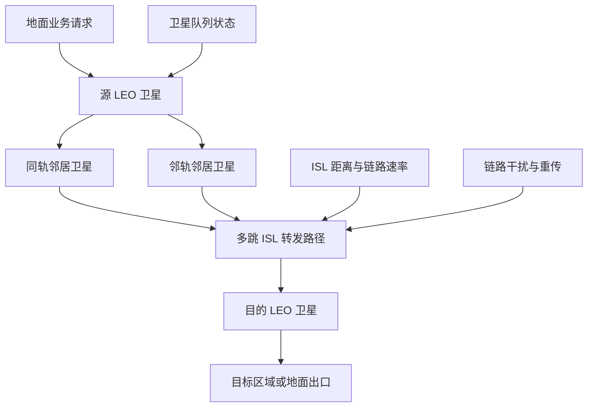
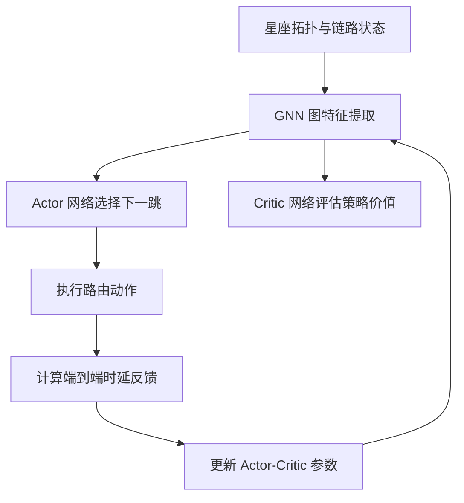

# 从 GNN 与强化学习看 Mega LEO 星座的分布式路由

## 1. 论文基本信息

* 英文标题：Graph Neural Network and Reinforcement Learning Based Routing for Mega LEO Satellite Constellations
* 中文理解标题：面向超大规模 LEO 星座的 GNN 与强化学习联合路由方法
* 作者：Senbai Zhang, Aijun Liu, Chen Han, Rui Wang, Xiaohu Liang, Xin Xu, Xin Lin
* 期刊/会议：2023 9th International Conference on Computer and Communications (ICCC)
* 年份：2023
* DOI：10.1109/ICCC59590.2023.10507285
* IEEE Xplore 链接：https://ieeexplore.ieee.org/document/10507285
* 阅读日期：2026-06-25
* 关键词：LEO satellite communication, mega constellation, routing, reinforcement learning, graph neural network, latency

## 2. 为什么选择这篇论文

这篇论文不直接讨论 cell-free massive MIMO 或 SINR prediction，但它对当前研究方向有一个很实用的补充：LEO 网络不是静态基站集合，而是一个高速变化、链路不断重组的图结构系统。当前研究工作如果要强调 millisecond-level inference、interference-aware message passing 和动态拓扑下的鲁棒性，就需要理解星座层路由、星间链路状态、业务负载和图学习之间的关系。

论文把 mega LEO satellite constellation 建模为 Walker-Delta 星座中的图，把每颗卫星视为节点，把稳定星间链路视为边，并将路由时延最小化作为目标。这个问题和 LEO satellite cell-free massive MIMO 的下行服务并不在同一层，但二者共享几个关键困难：拓扑动态、链路状态随时间变化、邻居关系天然适合消息传递、集中式全局优化难以满足低时延要求。因此，这篇论文适合作为 GNN/MPNN 在 LEO 网络图结构中发挥作用的参考样本。

## 3. 论文要解决的问题

mega LEO 星座通常包含大量低轨卫星，卫星之间通过 inter-satellite links (ISLs) 转发数据。传统路由方法可以预先计算路径，或者基于固定拓扑做启发式选择，但在真实业务中，卫星负载、链路距离、链路干扰和拓扑可用性都会变化。只靠静态最短路或预设虚拟拓扑，难以及时适应突发业务和链路状态变化。

论文关注的问题是：当源卫星需要把数据包转发到目的卫星时，如何在每一跳选择合适的下一颗卫星，使端到端时延尽量低。这里的时延不是单一距离决定的，而是由排队时延、传输时延和传播时延共同组成。排队时延反映卫星当前业务拥塞程度，传输时延受链路速率、带宽、功率、噪声和干扰影响，传播时延与星间距离有关。

作者提出 GRLR routing algorithm，将 reinforcement learning 的序贯决策能力和 graph neural network 的图特征提取能力结合起来，让卫星根据局部和邻域状态做分布式智能路由决策。论文的核心动机不是简单用深度学习替代 Dijkstra，而是让路由策略能从星座图结构、业务负载和链路状态中学习可泛化的转发规律。

## 4. 系统模型和关键假设

论文研究的是 Walker-Delta mega LEO 星座。每颗卫星与同轨和邻轨卫星建立稳定的星间链路，因此整个星座可以抽象成一个规则但规模很大的图。作者为了简化问题，将星座表示为 bidirectional Manhattan street network topology，这使得每个节点有稳定邻居，便于讨论分布式路由。

系统中，地面用户的数据进入源卫星后，需要通过多跳 ISL 转发到目的卫星。每一跳的代价由三部分组成：

* queue delay：当前卫星发送队列中的数据包造成等待；
* transmission delay：数据包在链路上的发送时间，受链路速率和重传次数影响；
* propagation delay：信号在卫星之间传播的物理时延。

论文还考虑链路干扰对 ACK 接收和重传的影响，因此传输时延不仅取决于链路距离，也和干扰环境有关。这个设定很重要，因为它把路由问题从“图上的最短距离”推进到“动态通信链路上的最小时延决策”。

## 5. 方法概述

GRLR 的思路可以概括为：用 GNN 读取星座图，用 Actor-Critic reinforcement learning 做下一跳决策。GNN 负责从卫星节点、邻接关系和链路状态中提取图结构特征；Actor 网络根据提取到的状态特征输出动作，也就是选择下一跳卫星；Critic 网络评估当前策略的价值，指导 Actor 更新。

这种结构适合 LEO 星座的原因在于，路由决策天然依赖邻居关系。对于某颗卫星来说，它不需要每次都重新求解全局组合优化问题，而是可以利用邻居状态、链路代价和训练得到的策略做快速选择。GNN 的作用是把“周围哪些链路拥塞、哪些方向更接近目的地、哪些邻居可能带来更低延迟”编码成可学习特征。

与传统路由相比，GRLR 的区别在于它不是固定规则，也不是只基于当前最短距离。它通过训练过程把时延反馈转化为策略更新，使模型逐步学习到在不同业务负载和链路状态下的路由偏好。与纯 RL 相比，GNN 提供了图结构归纳偏置，让策略更适合处理星座拓扑。

## 6. 关键公式或机制理解

第一个关键机制是单跳时延建模。论文将一跳时延写成 t_del = t_q + t_t + t_p。其中 t_q 是排队时延，反映卫星当前待发送数据量；t_t 是传输时延，反映链路速率和重传次数；t_p 是传播时延，主要由两颗卫星之间的距离和光速决定。这个公式的价值在于把路由代价拆成可解释的通信因素，而不是只看几何距离。

第二个关键机制是端到端路径时延。对于一条包含多跳的路径，总时延可以理解为所有跳的 t_del 之和。这样，路由策略每选一次下一跳，都会影响后续累计代价。强化学习适合这个问题，因为当前动作的好坏不只体现在当前一跳，还会影响整条路径的最终时延。

第三个关键机制是 GNN 与 Actor-Critic 的结合。GNN 将星座图中的节点状态和链路状态聚合成特征表示；Actor 使用这些特征选择下一跳；Critic 估计策略价值并提供训练信号。这个组合和 interference-aware message passing 的思想有相通之处：都不是把节点孤立处理，而是让邻居关系和链路交互进入模型。

## 7. 论文方法或系统框架

图 1：论文系统模型框架，展示 mega LEO 星座中地面业务经源卫星进入星间链路，并通过多跳 ISL 转发到目的卫星的过程；队列状态、链路距离、速率和干扰共同影响路由代价。

图 2：GRLR 方法流程，展示从星座图状态输入、GNN 特征提取、Actor-Critic 下一跳决策到时延反馈训练的主要路径。

## 8. 实验设置与结果理解

论文通过仿真评估 GRLR 在 mega LEO 星座路由中的表现。作者将 Walker-Delta 星座作为网络拓扑，并把卫星业务量、ISL 长度和链路干扰纳入路由决策。评价重点是收敛速度和路由时延，比较对象包括传统或基线策略。

从可确认信息看，论文的主要结论是：GRLR 相比基线策略具有更快的收敛表现，并能降低端到端路由时延。这里不能把仿真结果直接解释成真实星座部署收益，因为实际系统还会受星上计算能力、链路测量误差、时钟同步、轨道预测误差和网络协议开销影响。但实验说明，GNN 与 RL 结合后，确实可以在星座图结构中学习比静态规则更灵活的路由策略。

对当前研究方向而言，实验部分最值得关注的不是某个绝对时延数值，而是“图结构学习 + 低时延决策”的验证方式。对于 SINR prediction 或 IA-MPNN，也可以采用类似逻辑：定义清晰的动态图输入、选择可解释的评价指标，再和传统模型、无消息传递模型、无干扰特征模型进行对比。

## 9. 对我自己论文的启发

第一，对 LEO 卫星网络建模的启发是，星座层拓扑不应只作为背景介绍。论文把卫星、ISL、队列和链路干扰放入统一图模型，这提醒当前研究工作在描述 LEO satellite cell-free massive MIMO 时，也可以更明确地区分节点、边和状态变量。卫星接入点、用户、星间链路、可见性窗口和 CSI 更新都可以被组织成动态图，而不仅是传统矩阵变量。

第二，对 cell-free massive MIMO 的启发是，分布式协作一定会受到网络层时延约束。CF-mMIMO 论文常关注波束成形、功率控制和 SINR，但在 LEO 场景中，协作卫星之间的状态交换和路由路径会影响 CSI 是否及时、控制信息是否同步。如果中心处理或星间协作时延过大，理论上的协作增益可能被 channel aging 抵消。

第三，对 SINR prediction 的启发是，预测模型可以显式吸收图结构信息。论文中的 GNN 处理卫星邻接关系，当前研究中的 IA-MPNN 也可以把干扰源、服务链路和相邻卫星关系编码为消息传递边。不同的是，GRLR 输出下一跳动作，而 SINR prediction 输出链路质量或用户级 SINR。二者都依赖局部邻域信息，只是监督信号和任务目标不同。

第四，对 channel aging 和 residual Doppler 的启发是，动态星座中的时延不是附属变量。论文把路由时延作为优化目标，而当前研究工作可以进一步把 CSI 过期、Doppler 残差和推理延迟放在同一个时间尺度里解释。比如，当模型需要 millisecond-level inference 时，应该说明预测结果在哪个时间窗口内仍然有效，以及 residual Doppler 会如何改变干扰结构。

第五，对 interference-aware message passing 的启发是，干扰不一定只在物理层公式里出现，也可以作为图边特征参与学习。GRLR 把链路干扰和重传纳入时延代价；IA-MPNN 可以把干扰链路强度、相对运动、历史 SINR 误差和邻居负载作为消息内容，使模型不仅知道“谁连接谁”，还知道“谁正在影响谁”。

第六，对实验指标的启发是，应同时呈现精度、覆盖和延迟。GRLR 关注收敛和 latency；当前研究若只报告 MAE 或 RMSE，可能不足以说明模型适合 LEO 场景。更完整的实验叙述可以包括 CP、MAE、推理 latency、不同 channel aging 条件下的性能退化，以及动态图负载变化下的鲁棒性。

第七，对 IEEE TVT 审稿意见回复的启发是，系统动态性需要被具体化。面对“模型是否适合快速移动 LEO 场景”的质疑时，可以借鉴这类论文的写法，把动态拓扑、链路时延、干扰变化和低时延决策逐项拆开，而不是笼统说方法适合 6G NTN。

第八，对后续论文表述的启发是，GNN 的必要性要从图结构本身讲清楚。论文选择 GNN 是因为星座天然是图，路由动作依赖邻居。当前研究也应说明 MPNN 不是为了追赶热点，而是因为 LEO CF-mMIMO 中干扰关系、服务关系和拓扑关系都具有可消息传递的结构。

## 10. 这篇论文的优点

* 问题定义清楚，把 mega LEO 星座路由落到端到端时延最小化。
* 时延模型包含排队、传输和传播三部分，比单纯最短路径更贴近通信系统。
* 将 GNN 与 Actor-Critic 强化学习结合，方法结构和星座图拓扑匹配。
* 关注分布式智能路由，适合大规模星座中低时延决策的需求。
* 实验围绕收敛和时延展开，评价指标与路由任务直接相关。

## 11. 这篇论文的局限

* 论文主要基于仿真，真实星上计算、协议栈和链路测量开销仍需进一步验证。
* Walker-Delta 和稳定 ISL 假设有助于建模，但对更复杂的星座拓扑适配性还需要讨论。
* 方法关注路由层时延，对物理层波束、SINR、CSI aging 和 Doppler 补偿的联动分析较少。
* GNN/RL 模型训练和部署成本没有成为核心讨论点，实际星上资源约束可能影响落地。
* 论文没有把安全性、链路中断和异常业务突发作为主要实验场景。

## 12. 我可以借鉴的写作句式或结构

* 问题引入方式：先说明 mega LEO 星座的全球覆盖价值，再指出动态拓扑、异构资源和业务不均衡使传统路由难以适配。
* related work 组织方式：按传统虚拟拓扑路由、强化学习路由、GNN 图学习方法逐步推进，最后引出本文组合方法。
* contribution 写法：先给出问题建模，再给出算法结构，最后说明仿真验证指标。
* experiment 叙述方式：将“收敛速度”和“端到端时延”作为主线，而不是堆砌多个不相关指标。
* limitation 表述方式：可以客观承认系统简化假设，同时强调该假设如何服务于核心机制验证。

## 13. 后续可以继续追的问题

* GNN/RL 路由能否和 LEO CF-mMIMO 的协作簇选择、波束成形和功率分配联合建模？
* 如果 CSI aging 和 residual Doppler 影响链路质量，路由策略是否需要实时感知物理层预测结果？
* 面向 millisecond-level inference，星上部署 GNN/MPNN 的计算预算和推理延迟如何评估？
* 在动态业务和链路中断场景中，message passing 模型的鲁棒性如何系统测试？
* 是否可以把路由层 latency、物理层 SINR prediction error 和覆盖概率 CP 放入统一实验框架？

## 14. 一句话总结

这篇论文的价值在于，它把 mega LEO 星座中的动态路由问题转化为图结构上的低时延智能决策，为当前研究工作中使用 interference-aware message passing 处理 LEO 网络动态性提供了直接参考。

## 15. 引用信息

S. Zhang, A. Liu, C. Han, R. Wang, X. Liang, X. Xu, and X. Lin, "Graph Neural Network and Reinforcement Learning Based Routing for Mega LEO Satellite Constellations," 2023 9th International Conference on Computer and Communications (ICCC), 2023, doi: 10.1109/ICCC59590.2023.10507285.
